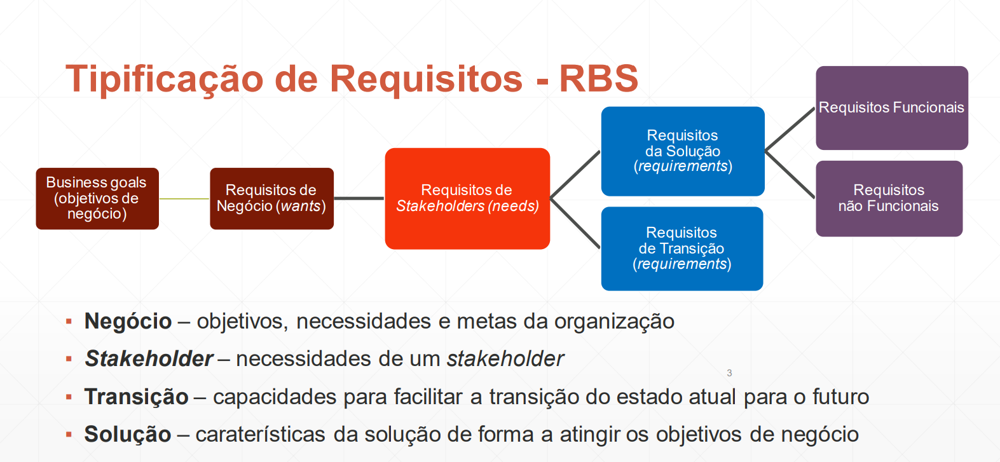

# Índice

- [Introdução](#introdução)
- [Engenharia de requisitos - Tarefas](#engenharia-de-requisitos---tarefas)
- [Tipificação de requisitos](#tipificação-de-requisitos)
- 

# Introdução

- Motivação
    - São poucos os projetos que atinjem os resultados definidos dentro do budget e claendário definido 
    - Quase metade dos projetos sem sucesso tiveram um pobre levanatmento de requisitos
- Problema
    - Perceber os requisitos de um desafio é a tarefa mais difícil para um software engineer
- Problemas mais comuns
    - Tacit Knowledge
    - False Assumptions
    - Undocumented Knowledge
- Requisito
    - O que é?
        - Condição necessária pelo utilizador para resolver um problema
        - Capacidade que deve ser atingida ou incorporada por um sistema para satisfazer um objetivo
- Engenharia de requisitos
    - Tarefas e técnicas que ajudam a perceber os requisitos
    - Começa na fase de comunicação e vai até à fase de modelação
    - Deve ser adapatada às necessidades do processo, projeto, produto e pessoas envolvidas
    - Fornece os mecanismos necessários para:
        - Perceber o que cliente deseja
        - analisar a necessidade
        - negociar uma solução razoável
        - validar as especificações
        - gerir requisitos
    - Engloba 7 tarefas distintas (algumas acontecem em paralelo):
        1. Inception
        2. Elicitation
        3. Elaboration
        4. Negotiation
        5. Specification
        6. Validation
        7. Management
- Project vs Product Requirements - Approaches

    
| Aspect                            | Project                               | Product                              |
| ----------------------------------| --------------------------------------| -------------------------------------|
| **Duration**                      | Have a Begin and End date             | Permanent (until decommissioned)    |
| **Team Duration**                 | Short-term team                       | Long-lived team                      |
| **Planning Approach**             | Predictive Planning (up-front)       | Adaptive planning (iterative)       |
| **Delivery Approach**             | One-off delivery                      | Continual Improvement                |
| **Customer Needs (Requirements)** | Project Requirements                  | Evolving customer needs (requirements) |
| **Investment Outcome**            | Investment delivers scope             | Investment delivers benefits/KPIs   |

- Project vs Product Requirements - Inputs

| Input                                | Project                                   | Product                                       |
| -------------------------------------| ------------------------------------------| ----------------------------------------------|
| **Customer Input**                   | Customer request                          | Strategical positioning                        |
| **Stakeholder Input**                | Stakeholder Request                       | Market needs                                  |
| **Demand Input**                     | Sales Demand                              | Competitive benchmark                         |
| **Development Collaboration**        | Development with external parties        | Continuous feedback and Improvement           |

- Project vs Product Requirements - Stakeholders

| Stakeholder Category                | Project Stakeholders                                   | Product Stakeholders                                        |
| ------------------------------------| ------------------------------------------------------ | ------------------------------------------------------------|
| **Customer Involvement**             | Specific Customer                                     | Multiple requests from different customers                  |
| **External Collaboration**           | External providers/systems                           | Lack of functionality due to competition                    |
| **Company Involvement**              | Company Sponsor                                       | New markets (e.g., country)                                  |
| **Sales Focus**                      | Sales                                                 | Continuous feedback from internal departments               |
| **Executive Support**                | Executive team                                        | UX, Delivery, Support, Customer Success Managers, etc.       |
| **Innovation Input**                 | Etc.                                                 | Innovation                                                  |

- Project vs Product Requirements - Requirements

| Requirement Category                | Project                                       | Product                                                   |
| ------------------------------------| ---------------------------------------------- | ---------------------------------------------------------|
| **Nature of Requirements**          | Specific request                              | Analyze landscape to meet the goal in the most efficient way |
| **Approach to Requirements**         | N/A                                          | Extra techniques need to be applied to define requirements properly |

# Engenharia de requisitos - Tarefas

- Fontes de requisitos:
    1. Análise de concorrência
    2. Anális de diferenciação
    3. Dinâmica de Mercado e investigação
    4. Investigação de utilizador
    5. Resposta ou Reação
    6. Criativdade
    7. Introspeção
    8. Mineração de Dados
    9. Análise do sistema atual
    10. Monitorização do sistema
    11. Análise técnica
    12. Análise de documentação
- Inception
    - O que é? -> Na fase inicial do projeto, estabelece-se uma compreensão básica do problema, das pessoas que buscam uma solução, da natureza da solução desejada, e avalia-se a eficácia da comunicação e colaboração preliminares entre as partes interessadas e a equipe de software.
    - o que se faz?
        - Identificar stakeholders
        - Reconhecer vários pontos de vista
        - Trabalhar em colabaração
    - Perguntas a fazer?
        - O primeiro conjunto de perguntas deve-se focar no cliente, outros stakeholders e o objetivo global do projeto.
        - A seguir, devem ser realizadas perguntas que permitem melhor perceber o problema deixar o cliente verbalizar a sua perceção de uma solução.
        - Para finalizar, as últimas perguntas devem-se focar em comunicar efetivamente, exemplos:
            - Are you the right person to answer these questions? Are your answers “official”?
            - Are my questions relevant to the problem that you have?
            - Am I asking too many questions?
            - Can anyone else provide additional information?
            - Should I be asking you anything else?
    - Business analyst
        - Indivíduo, cuja responsabilidade principal é elicitar, analisar, documentar e validar as necessidades dos stakeholders
        - Recolhe e analisa informação do produto 
        - É um project role e não uma posição de emprego necessáriamente.
- Elicitation
    - O que é?
        - Junção de resolução de problemas, elaboração, negociação e especificação
        - Apoia a ideia de trabalho em colaboração, orientado à equipa
        - stakeholders trabalham juntos
        - Propõe possíveis soluções
        - Negoceia diferentes abordagens
        - Especifica uma versão preliminar dos requisitos da solução
    - Requisitos de colaboração
        - Reuniões entre os engenheiros e stakeholders
        - Regras são estabelecidas
        - Mix de formal e informal
        - Existe um tipo de mediador
        - Um "mecanismo de definição" ( folhas, charts, quadros, etc) são usados
    -  QFD -> Quality function Deployment
        - Mecanismo que traduz as necessidades do cliente para requisitos técnicos em software
        - Existem 3 tipos de requisitos: exptectáveis, normais e "extras"
    - Cenários de uso
        - Use cases são criados para mais fácilmente entender o funcionamento das coisas e como o sistema vai ser usado pelos seus utilizadors
- Técnicas de Elicitação
    - Entrevistas
        - Faz-se perguntas
        - Utilizador está diretamente envolvido
        - Perguntas devem ser preparadas
    - Questionários
        - Melhor para grupos grandes
        - Sem custo e independente a nível geográfico
        - Usado para feedback
        - Desafio: prepará-los
    - Workshops
        - Vários stakeholders juntos
        - Necessidade de um mediador
        - pode ser intensivo a nível de recursos
        - Todos podem participar
    - Focus groups
        - representam grupos de utilizadores
        - tem de ser interativo
        - Útil para exlporar as atitudes dos utilizadores
        - feedback subjetivo
    - Observações
        - Observar os utilizadores a realizar tarefas
        - Consome tempo
        - tarefas mais importantes devem ser as escolhidas
        - Os utilizadores podem ou não podem ser interrompidos
        - Informação obtida deve ser documentada
    - Análise de documentação
        - Examinar documentação já existente
        - pode revelr informação não dita pelos utilizadores
        - Risco: Documentação pode estar desatualizada
    - Análise de user Interface
        - Estudar sistemas existentes
        - se interação não é possível, usar screen shots
        - Ajuda a perceber com um sistema existente funciona
    - Análise de interface de sistema
        - exmainar outros sistemas aos quais o nosso se liga
        - revela requisitos funcionais 
        - Identifica funcionalidades
- Work product
    - Pode ser:
        - Uma afirmação acerca da necessidade
        - Escopo do projeto ou sistema
        - Lista de clinetes, utilizadores e outros stakeholders
        - Descrição técnica do ambiente do sistema
        - Lista de requisitos e restrições de domínio
        - Lista preliminar de cenários de uso
        - Protótipos
- Elicitation Plan
    - Elicitation objectives
    - Elicitation strategy and planned techniques
    - Schedule and resource estimates
    - Documents and system needed for each elicitation
    - Expected products
    - Elicitation risks
- Planning for Elicitation
    - Plan session scope and agenda
    - Prepare resources
    - Learn about the stakeholders
    - Prepare questions
    - Prepare analysis models
- Elaboration
    - A informação obtida do cliente durante a concepção e elicitação é ampliada e refinada durante a elaboração. Esta tarefa concentra-se no desenvolvimento de um modelo de requisitos refinado que identifica vários aspectos da função, comportamento e informações do software. A elaboração é conduzida pela criação e refinamento de cenários de usuário que descrevem como os atores interagirão com o sistema
    - Elementos de uso:
        - Orientados ao cenário
        - Orientados à classe
        - De comportamento
        - Orientados ao fluxo
- Negociação
    - Não é incomum que clientes e usuários solicitem mais do que pode ser alcançado, dadas as limitadas recursos empresariais. Também é relativamente comum que diferentes clientes ou usuários proponham requisitos conflitantes, argumentando que sua versão é "essencial para nossas necessidades específicas". Você precisa reconciliar esses conflitos por meio de um processo de negociação. Os clientes, usuários e outros interessados são solicitados a classificar os requisitos e, em seguida, discutir conflitos de prioridade.
    - Fazer o balancemanento entre o custo de desenvolvimento e funcionalidades a desenvolver
    - Melhores negociações querem obter um resultado "win-win"
    - Documentar conflitos entre stakeholders:
        - Identificação dos conflitos
        - Análise dos conflitos
        - Resolução dos conflitos
        - Aceitação da resolução de conflitos
- Specification
    - A Especificação de Requisitos de Software (SRS) pode ser um documento escrito, um conjunto de modelos gráficos, um modelo matemático formal, uma coleção de cenários de uso, um protótipo, ou qualquer combinação destes.
    - Melhor abordagem para sistemas grandes e complexos
    - Casos de uso chegam para produtos mais pequenos
    - ISO/IEC/IEEE 29148:2011
        - International Standard
        - Propõe vários entregáveis
        - Sugere algo detalhado
        - Vai de acordo com metodologias ágeis
        - Apropriado para produtos de software?
        - Deve ser adaptado de acordo com as necessidades do projeto.
-  Validação
    - À medida que cada elemento do modelo de requisitos é criado, ele é examinado em busca de inconsistências, omissões e ambiguidades. Os requisitos representados pelo modelo são priorizados pelos interessados e agrupados em pacotes de requisitos que serão implementados como incrementos de software.
    - Perguntas a fazer:
        - Os requisitos são consistentes com o objetivo do projeto
        - Todos os requisitos foram detalhados no adequado nível de abstração nesta fase?
        - O requisito é necessário?
        - Existe conflitos entre os requisitos
        - Podem ser testados, após a sua implementação
        - etc, sei lá
- Gestão (Management)
    - Os requisitos para sistemas baseados em computador mudam, e o desejo de alterar requisitos persiste ao longo da vida do sistema. A gestão de requisitos é um conjunto de atividades que auxilia a equipe do projeto a identificar, controlar e rastrear requisitos e alterações nos requisitos a qualquer momento conforme o projeto avança.
    - Cada requisito tem um id
    - São postos em tabelas de track
    - tabelas são guardadas em bases de dados
    - Track de requisitos também é guardado

# Tipificação de requisitos

- Furps+
    - Funcionais
    - Usabilidade
    - Robustez/Confiabilidade
    - Dessempenho
    - Capacidade de suporte
    - Restrições
- RBS, segundo ISO/IEC 2510
    - Adequação funcional
    - Performance
    - Compatibilidade
    - Confiabilidade
    - Usabilidade
    - Segurança
    - Manutenção
    - Portabilidade
- Product Breakdown Structure (PBS)
    - Uma Estrutura de Decomposição de Produtos é um gráfico hierárquico que captura os produtos físicos de um projeto/produto que são necessários para alcançar o sucesso. Seu propósito é separar o produto final do projeto em suas partes constituintes. Começa com o entregável final e o decompõe em uma estrutura hierárquica até os produtos mais pequenos que iniciam a cadeia.

# From ideas to users - Discover/intro

- BABOK vs Discover/Craft/Deliver

| Aspect                               | BABOK                                       | Discover/Craft/Deliver                          |
| -------------------------------------| -------------------------------------------- | ---------------------------------------------- |
| **Approach**                         | Top-down approach                           | Collaborative approach                         |
| **Orientation**                      | Service/Project oriented                    | Product oriented                               |
| **Procedure Formality**               | Formal procedure                            | Less formal, faster iterations                 |
| **Approval Process**                  | Formal sign-off                             | N/A (implied less formal)                      |
| **Time Efficiency**                   | Time consuming                              | More focus on goals/metrics, less focus on features |
| **User Orientation**                  | Less user oriented                          | More focus on the experience                   |
| **Feature Focus**                     | More focus on features                      | Less focus on features                         |
| **Change Requests Management**        | Easy to manage change requests              | Empowers innovation                            |

- Discover - find problems
    - Objetivos:
        - Perceber o cliente
        - Descobrir oportunidades de mercado
    - Como
        - Ter 10 no exame
        - Análise de competição
        - Análise de diferneciação
        - Pesquisa de mercado
- Discover - frame problems
    - Objetivo
        - Confirmar problemas
    - Como?
        - Métodos estudados anteirormente
        - Análise técnicas
        - jobs-to-be-done
        - Pesquisa de utilizador
- Discover - Prioritizar problemas
    - trabalhar nos problemas com mais impacto
    - Discussões com equipas de estratégias
    - Frameworks de prioritização
- CRaft - Specify
    - Traduzir as necessidades do negócio e a solução nalgo de ação para os engenheiros
    - flow charts
    - Especificações
    - Critérios de aceiração
- Craft - Design
    - Objetivos de usabilidade, utilidade
    - User journey maps
    - Benchmarks
    - Wireframes
    - User Tests
    - Decision Docs
- Craft - Tech Strategy
    - Criar uma solução simples e escalável
    - Diagramas de arquitetura
    - Diagramas de Dbs
    - API design
- Delivery - Plan Work
    - Estimar e dividir em milestones
    - Backlog
    - PLano
- Delivery - Sprint
    - Desenvolver a solução planeada
    - Escrever código
    - Testar
- Delivery - Release
    - Lançar a solução/produto
    - Deploy
    - Documentar
    - Comunicar
    - Medir
    - Iterar

- Outras maneiras:
    - Appendix
    - Design thinking
    - Jobs to be done
    - SCRUM
    - SAFE - Business Agility
- Disclaimer
    - Dependendo da maturidade do produto, há processos que farão mais sentido que outros
    - Dependendo do produto/empresa, certos processos podem sofrer alterações