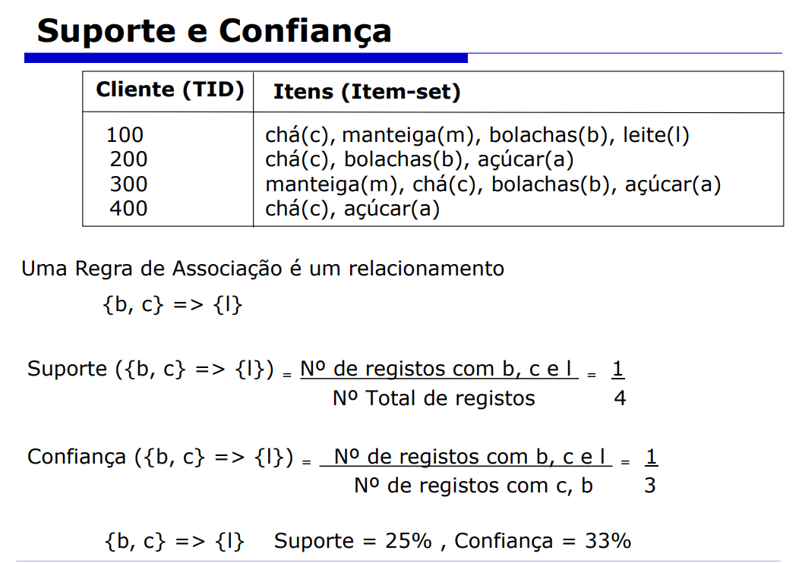
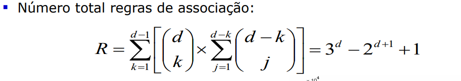
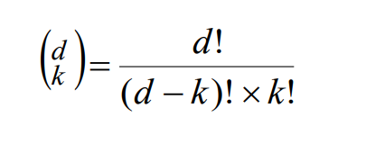
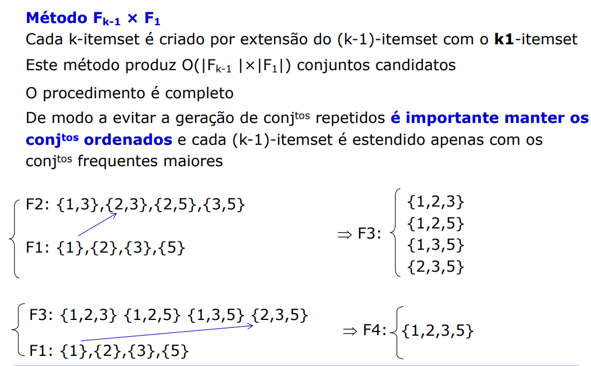
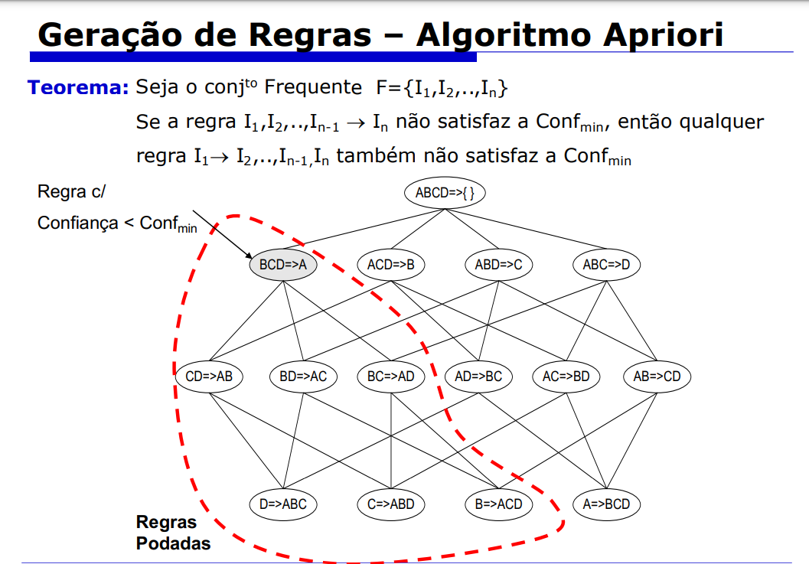
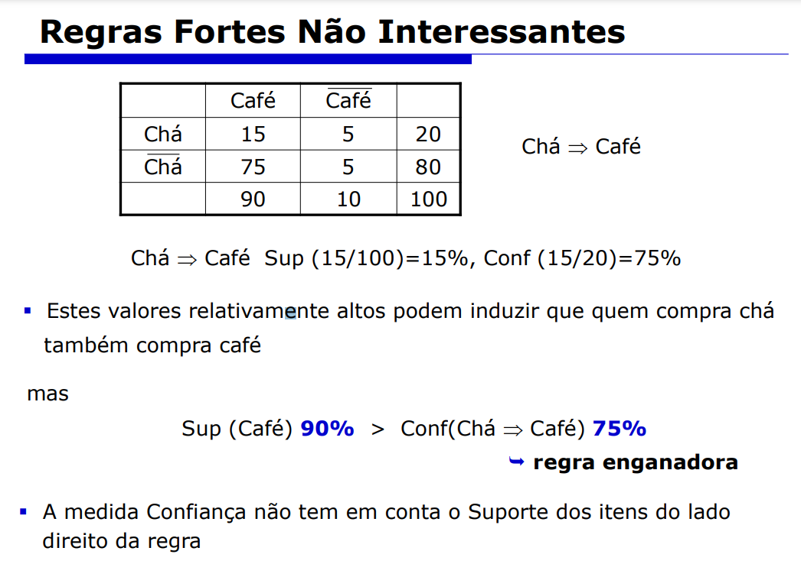
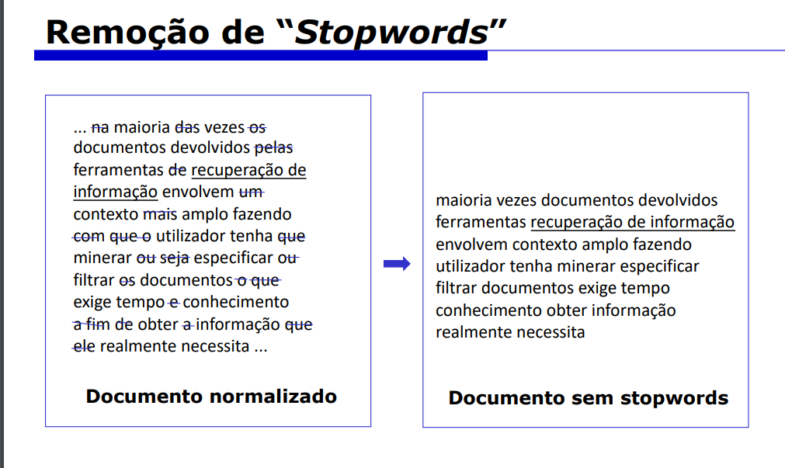
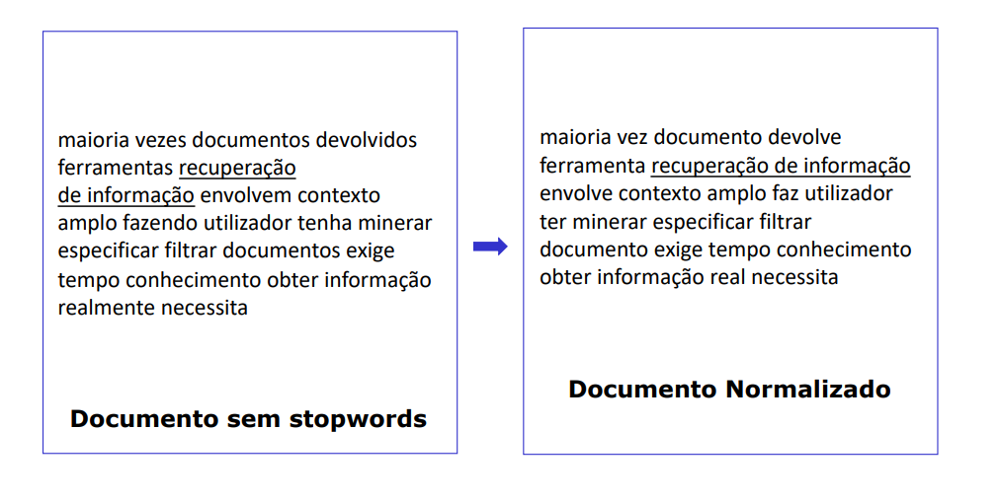
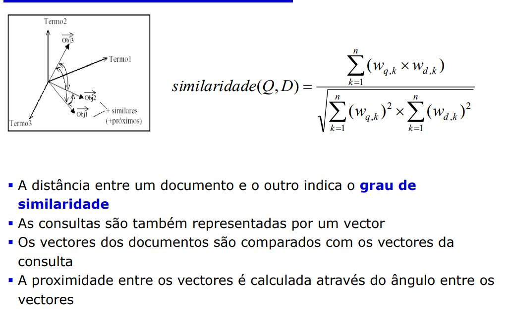
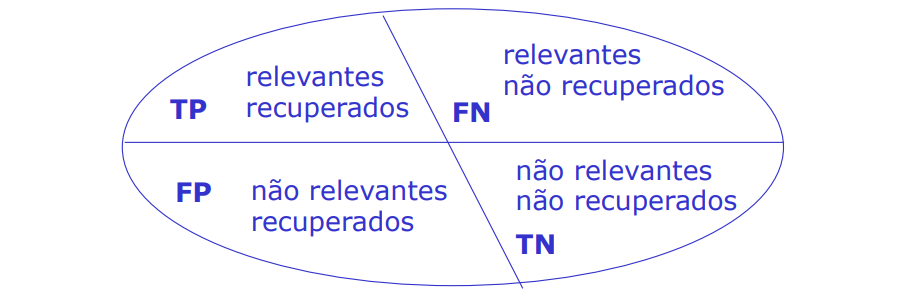

# Índice

- [Modelos Preditivos](#modelos-preditivos)
- [Avaliação de Modelos](#avaliação-de-modelos)
- [Regras de Associação](#regras-de-associação)
- [Text Mining](#text-mining)
- [Séries Temporais](#)

# Modelos Preditivos

## Aprendizagem Baseada em Instâncias (KNN)

- Conhecido como o método dos k-vizinhos mais próximos
- a previsão de valores (discretos/contínuos) é feita com base nos valores mais próximos
- Baseia-se em dois conceitos:
    - Distância entre 2 registos
    - Combinação dos resultados através dos vizinhos
- Distância Euclidiana é usada para calcular a distância entre 2 pontos
- Normalização deve ser aplicada aos atributos
- Para uma função ser usada como distância as seguintes propriedades têm de ser válidas, para quaisquer p, q, d:
    - 
    - 1: A distância entre 2 pontos não pode ser negativa
    - 2: A distância de um ponto a ele próprio é nula
    - 3: A ordem dos pontos não afeta a distância entre eles (simetria)
    - 4: A distância entre dois pontos é sempre menor ou igual à soma das distâncias de um ponto intermediário (Desigualdade triangular)
- Escola do K
    - O valor deve ser ímpar
    - A escolha deve ser experimental (o k com os melhores resultados, será o k escolhido)
    - Valores pequenos de k -> podem aumentar a contribuição de exemplos ruidosos
    - Valores maiores de k -> podem aumentar a contribuição de exemplos pouco similares, ou seja, menos relevantes
-Vantagens/desvantagens: 

| Aspecto                              | Vantagens                                                                                        | Desvantagens                                                                                                |
| -------------------------------------|--------------------------------------------------------------------------------------------------|------------------------------------------------------------------------------------------------------------|
| Processamento de variáveis dependentes | Processa qualquer número de variáveis dependentes                                                 | Computacionalmente intensivo no cálculo das distâncias entre casos                                        |
| Tipo de previsão                      | Pode ser usada para prever valores contínuos ou discretos                                         | Os resultados dependem da função distância usada, da função combinação e do número de vizinhos usados      |
| Função de distância                   | Qualquer função de distância pode ser usada                                                       | Necessita de grandes conjuntos de treino                                                                    |
| Implementação fácil                   | Fácil de implementar                                                                             | Sensibilidade a valores isolados e variáveis irrelevantes                                                  |
| Atualização do modelo                 | Facilmente atualizado por expansão ou substituição do conjunto de treino                         | Ausência de qualquer modelo para "mostrar" ao utilizador                                                  |
| Compreensão dos resultados            | É fácil entender os resultados                                                                  |                                                                                                            |

## Aprendizagem Baseada em Probabilidades (Naive Bayes)

- Teoria Bayesiana -> Usa dados do passado para estimar probabilidades de eventos futuros
    - Requer probabilidades à priorio
- A teria Bayesiana faz 2 assunções:
    - Os atributos são todos igualmente importantes
    - Os atributos são estatisticamente independentes
- Teoria da Probabilidade
    1. **Espaço Amostral (S):** O conjunto de todos os resultados possíveis de um experimento aleatório é chamado de espaço amostral.

    2. **Evento (E):** Um evento é um subconjunto do espaço amostral, ou seja, é um conjunto de resultados possíveis.

    3. **Probabilidade de um Evento (P(E)):** A probabilidade de um evento é uma medida numérica que representa a chance relativa de o evento ocorrer. A probabilidade de um evento está sempre no intervalo de 0 a 1.
        - $$ 0 \leq P(E) \leq 1 $$

    4. **Regra da Soma:** Para quaisquer dois eventos mutuamente exclusivos (eventos que não podem ocorrer simultaneamente), a probabilidade da união dos eventos é a soma das probabilidades dos eventos individuais.
        - $$ P(A \cup B) = P(A) + P(B) $$,
         se \( A \) e \( B \) são mutuamente exclusivos.

    5. **Regra Geral da Soma:** A probabilidade de qualquer evento pode ser encontrada pela soma das probabilidades dos eventos individuais e subtraindo a probabilidade da interseção dos eventos, se houver.
        - $$ P(A \cup B) = P(A) + P(B) - P(A \cap B) $$

    6. **Probabilidade Condicional:** A probabilidade condicional de um evento \(A\) dado que ocorreu um evento \(B\) é denotada por \(P(A|B)\) e é definida como a probabilidade de \(A\) ocorrer, dado que sabemos que \(B\) ocorreu.
        - $$ P(A|B) = \frac{P(A \cap B)}{P(B)} $$

    7. **Regra do Produto:** A probabilidade da interseção de dois eventos, \(P(A \cap B)\), pode ser encontrada multiplicando a probabilidade de um evento pelo condicional do outro evento.
        - $$P(A \cap B) = P(A) \cdot P(B|A)$$

    8. **Eventos Independentes:** Dois eventos, \(A\) e \(B\), são independentes se a ocorrência (ou não ocorrência) de um evento não afeta a probabilidade do outro.
        - $$ P(A \cap B) = P(A) \cdot P(B) $$
- Classificador Bayesiano Naive (Ingénuo)
    - O **Classificador Bayesiano Naive** realiza a suposição ingênua, ou seja, assume que as variáveis \(a_1, a_2, ..., a_n\) são independentes. Seja \(v_j\) o valor do atributo a ser previsto para uma instância da amostra com \(n\) atributos preditivos \(a_1, a_2, ..., a_n\), a probabilidade do valor \(v_j\) do atributo a ser previsto é igual ao produto das probabilidades individuais de cada atributo.
    - 
    - 
-  Suposição Naive Bayes
    - O **Naive Bayes** assume independência condicional de classe, o que implica que os eventos são considerados independentes quando condicionados ao mesmo valor de classe.
- Problemas do Classificador Bayesiano
    - Se a probabilidade condicional de um atributo for nula, a probabilidade da classe também será nula.

    - Se os exemplos de treino não cobrirem todos os valores possíveis dos atributos, a classificação de determinados registros pode se tornar impossível.
- Estimativa de Laplace
    - O problema anterior pode ser resolvido, usando a **estimativa de Laplace**
    - O **estimador de Laplace** envolve adicionar uma pequena quantidade a cada uma das contagens na tabela de frequência, garantindo que cada característica tenha uma probabilidade não nula. Geralmente, o estimador de Laplace é ajustado para 1, assegurando que cada combinação de características da classe esteja presente nos dados pelo menos uma vez.
- Teorema de Bayes
    - O **Teorema de Bayes** aplicado como classificador requer o conhecimento de:

    - Duas probabilidades a priori: \(P(\text{decisão}_i)\).
    - Uma probabilidade condicional: \(P(x|\text{decisão}_i)\).

    - Este classificador é ótimo no sentido de que, em média, nenhum outro classificador pode obter melhores resultados usando a mesma informação. No entanto, na prática, essas probabilidades são desconhecidas.

    - Estimar confiavelmente essas probabilidades a partir de um conjunto de exemplos requer um número infinito de exemplos.

    - São feitas simplificações no cálculo de \(P(x|\text{decisão})\), assumindo que os atributos são independentes da decisão.

    - O **Classificador Bayesiano Naive** é uma aplicação prática desse teorema, assumindo a independência condicional entre os atributos.
- Probabilidades a partir de Atributos Contínuos
    - Para lidar com atributos contínuos, é comum:

    - **Discretizar:**
        - Realizar uma partição baseada em dois valores, como \( (A < v) \) ou \( (A > v) \).

    - **Estimativa baseada na densidade de Probabilidade:**
        - Assume-se que o atributo segue uma distribuição normal ou binomial.
        - Utiliza-se a amostra para estimar os parâmetros da distribuição, como média (\(\mu\)) e desvio padrão (\(s\)).
    - Estima-se a probabilidade condicional \(P(A_i|c)\) usando a fórmula:

    $$ P(A_i|c) = \frac{1}{\sqrt{2\pi s^2}} \exp\left(-\frac{(A_i - \mu)^2}{2s^2}\right) $$

    - onde:
        - \(\mu\) é a média.
        - \(s\) é o desvio padrão.
        - \(A_i\) é o valor do atributo contínuo.

    Essa abordagem permite trabalhar com atributos contínuos no contexto do Classificador Bayesiano Naive, assumindo uma distribuição conhecida e estimando seus parâmetros a partir dos dados amostrais.
- Vantagens/Desvantagens:

| **Vantagens**                                  | **Desvantagens**                                      |
| ---------------------------------------------- | ------------------------------------------------------ |
| 1. Robusto no tratamento de valores isolados    | 1. Cálculo de um número elevado de probabilidades      |
| 2. Robusto no tratamento de atributos irrelevantes | 2. Necessidade de amostras suficientemente representativas (elevada dimensão) |
| 3. Fácil de implementar                        | 3. Suposição de independência condicional               |
| 4. Capaz de classificar amostras com valores ausentes | 4. Não capta dependências entre variáveis               |
| 5. Considera todos os atributos como igualmente importantes | 5. Desempenho pode ser afetado pela presença de atributos correlacionados |
| 6. Complexidade computacional linear em todas as variáveis do problema |                                                      |

# Avaliação de Modelos

- Estimativa de Desempenho:
    - Obter uma estimativa fiável do erro de previsão
    - Devemos Repetir os testes várias vezes
    - Estimativa final = média de estimativas individuais
    - Os dados utilizados para avaliação de qualquer modelo não podem ser usados durante o desenvolvimento do modelo
- Métodos:
    - Holdout
        - Dividir os dados (aleatóriamente) em 2 conjuntos diferentes:
            - Treino -> 2/3 do conjunto inicial
                - Maior o conjunto = melhor o modelo
            - Teste ->  1/3 do conjunto inicial
                - Maior o conjunto = mais fiável a estimativa de erro
        - Limitações:
            - Só é possível aplicar quando existe um grande número de dados e todas as classes estiverem bem representadas
            - O modelo é altamente dependente da composição dos conjuntos
            - Os conjuntos de treino e teste não são independentes
    - Holdout Repetido
        - O método holdout pode ser repetido várias vezes em ordem a melhorar a estimativa do desempenho do modelo
    - Cross-Validation
        - A validação cruzada é uma técnica importante na avaliação de modelos de machine learning. Consiste em dividir o conjunto de dados em K partições (folds), treinando o modelo em K-1 folds e avaliando-o no fold restante. Esse processo é repetido K vezes, garantindo que cada parte dos dados seja usada tanto para treinamento quanto para avaliação. 
        - O erro do modelo é então calculado como a média dos erros de previsão obtidos nas K iterações da validação cruzada. Essa abordagem ajuda a fornecer uma avaliação mais robusta do desempenho do modelo, reduzindo o impacto de uma única divisão inadequada dos dados.
        - A validação cruzada é essencial para evitar a superestimação ou subestimação do desempenho do modelo, fornecendo uma visão mais confiável sobre como o modelo generaliza para diferentes conjuntos de dados.
    -  Vantagens da Validação Cruzada
        - **Utiliza o máximo de dados possível para treino:** A validação cruzada permite que o modelo seja treinado com o máximo de dados disponíveis, o que é crucial para desenvolver modelos mais robustos e generalizados.
        - **Conjuntos de teste mutuamente exclusivos - cobrem todo o conjunto de dados:** A abordagem de validação cruzada garante que todos os dados sejam utilizados tanto para treinamento quanto para teste. Isso é fundamental para avaliar o desempenho do modelo em diferentes partes do conjunto de dados, garantindo uma avaliação abrangente.
        - **Estratificação reduz a variância das estimativas:** A estratificação, quando aplicada na validação cruzada, ajuda a reduzir a variância das estimativas do modelo. Isso significa que as métricas de desempenho são mais consistentes e confiáveis, mesmo quando o conjunto de dados pode ter variações significativas.
    - Leave One out
        - Em cada iteração um único caso é deixado fora do conjunto de treino
        - Na sua essência, é semelhante a VC com n-fold vezes
        - Na Validação Cruzada Leave-One-Out, para uma amostra de tamanho n, o modelo é treinado em n-1 exemplos e testado com o exemplo excluído. Esse processo é repetido n vezes, onde o erro é a soma dos erros em cada teste dividido por n.

            - **Amostragem não estratificada:** O teste é realizado apenas em um exemplo por vez, sem considerar estratificação nas classes.

            - **Procedimento determinístico:** Não há amostragem aleatória envolvida, tornando o procedimento determinístico.

            - **Computacionalmente dispendioso:** Esta abordagem é adequada para amostras muito pequenas devido à sua natureza computacionalmente custosa.

            - **Estimativa do desempenho do modelo com elevada variância:** Como o teste ocorre em um único exemplo por vez, a estimativa do desempenho do modelo pode ter uma variância elevada.
    - Bootstrap
        - No método de bootstrap, um conjunto de treino é formado selecionando n instâncias do conjunto inicial de dados com reposição, o que implica que, para grandes amostras, o conjunto de treino terá aproximadamente 63.2% das instâncias originais devido à probabilidade de seleção com repetição.
        - O conjunto de teste, formado pelas instâncias não selecionadas para o conjunto de treino (out-of-bag samples), em um método bootstrap é composto por aproximadamente 36.8% das instâncias originais para grandes amostras, sendo esse procedimento de amostragem repetido k vezes para obter uma estimativa final do erro.
- Que método usar e Quando?
    - Para grandes conjuntos de dados, o método mais adequado é o Holdout repetido.
    - Em conjuntos de dados de tamanho médio, k-fold (especialmente com k=10) é frequentemente escolhido, sendo comum repetir o processo k-fold várias vezes para aumentar a significância estatística e diminuir a variância.
    - A subamostragem aleatória é uma opção, embora menos frequentemente utilizada.
    - Para pequenos conjuntos de dados, Bootstrap e leave-one-out são escolhas comuns, sendo o Bootstrap a opção mais frequente com um grande número de repetições (por exemplo, 200).
- Avaliação de Modelos Regressão
    - 2 tipos de erros de previsão:
        - Erros dependentes da escala
        - Erros percentuais

 

- Matriz de confusão
    - 
    - Possuímos 4 classes/tipos de previsões:
        - TP -> True Positives, aka, dados previstos como positivos e são, na realidade, positivos
        - FP -> False Positives, aka, dados previstos como positivos, mas na realidade são negativos
        - TN -> True Negatives, aka, dados previstos como Negativos e são, na realidade, negativos
        - FN -> False Negatives, aka, dados previstos como negativos, mas, na realidade, são positivos
- Métricas para avaliação de desempenho
    - Accuracy:
        - Número de previsões corretas em relação ao nº total de previsões realizadas
        - Accuracy = (TP + TN) / (TP + TN + FP + FN)
        - O erro associado pode ser calculado subtraíndo a 1, a accuracy obtida
        - Taxa de erro = 1 - accuracy
    - Kappa
        - Avalia se a accuracy foi gerada aleatóriamente
        - 
        - Uma interpretação comum da estatística Kappa:
            - Menor que 0.20: Acordo Pobre
            - Entre 0.20 e 0.40: Acordo Fraco
            - Entre 0.40 e 0.60: Acordo Moderado
            - Entre 0.60 e 0.80: Bom Acordo
            - Entre 0.80 e 1.0: Muito Boa Concordância
    - Limitações da Accuracy:
        - Todas as classes previstas têm a mesma importância, logo não é adequada
        - especialmente para conjuntos de dados desbalanceados
        - classes com custos diferentes
    - Matrizes de custos
        - Usadas para calcular o custo associado às previsões realizadas por um modelo
        - Exemplo:
            -     
        - Esxitem métricas sensíveis ao custo:
            - Recall -> taxa de acerto na classe positiva
            - Specificity -> taxa de acerto na classe negativa
    - Taxa de Acerto Balanceada
        - Balanced Accuracy = (recall + specificity) / 2
    - Precision
        - Percentagem de previsões **positivas** corretas
            - precision = (TP)/(TP+FP)
    - Recall
        - Percentagem de exemplos positivos corretamente previstos
            - recall = (TP)/(TP + FN)
    - F1
        - Medida harmónica ponderada entre a precision e recall
            - F1 = $$ 2 * \frac{\text{Precision} \cdot \text{Recall}}{\text{Precision} + \text{Recall}}$$
    - Classificação Multi-Classe
        - Não existe classe positiva e negativa
        - Existem n-matrizes binárias, uma para cada classe
        - desempenho global é calculado através de medidas micro e macro-média
        - 
- Como comparar o desempenho de vários modelos?
    - Accuracy por si não chega, eis um exemplo que demonstra tal:
        - Dados dois modelos:
            - Modelo M1: Precisão (Accuracy) de 85%, avaliado em 30 instâncias.
            - Modelo M2: Precisão (Accuracy) de 75%, avaliado em 5000 instâncias.

       - A comparação direta entre M1 e M2 com base na precisão isoladamente não é suficiente para determinar qual é melhor, pois a quantidade de instâncias testadas também é um fator relevante. Para uma avaliação mais robusta, seria necessário considerar outras métricas ou contextos específicos de aplicação.
    - Curva ROC e AUC
        - A Curva ROC (Receiver Operating Characteristic) e a AUC (Área Sob a Curva) são métricas eficazes para comparar modelos em diferentes pontos de operação. Estas métricas fornecem uma representação visual da taxa de verdadeiros positivos em função da taxa de falsos positivos, permitindo a análise do desempenho do modelo em diversos limiares de classificação. A AUC, que representa a área sob a curva ROC, oferece uma medida agregada da capacidade discriminativa do modelo, sendo uma métrica útil para avaliar e comparar classificadores.
    - 

# Regras de Associação

- Têm por objetivo gerar todas as associações para as quais a presença de um ou vários itens específicos numa transação impliquem a presença de outros itens
- 
- Regras de classificação vs Regras de associação

| Características                | Regras de Classificação                                  | Regras de Associação                                      |
|--------------------------------|---------------------------------------------------------|------------------------------------------------------------|
| Atributo Objetivo              | Apenas um atributo objetivo                               | Vários atributos objetivo                                  |
| Especificação de Classes       | Especificam a classe para todas as instâncias            | Aplicáveis em apenas alguns casos                          |
| Medidas de Avaliação           | Accuracy, Precision, Recall, entre outras                | Suporte, Confiança, Interesse, entre outras                 |
| Tipo de Aprendizagem           | Supervisionada                                           | Não supervisionada                                        |

- Regras de associação (Tipos):
    - **Úteis**
        - Exemplo: Quem compra X compra Y
    - **Triviais**
        - Todos os inquiridos em estado de gravidez são do sexo feminino
    - **Inexplicáveis**
        - Na abertura de uma determinada loja o artigo mais vendido foram os guardanapos
- Conceitos básicos
    - As Regras de Associação são calculadas a partir dos dados e têm natureza probabilística
    - Regras de Associação devem ser interpretadas com cuidado
        - $$ A \Rightarrow B $$ 
            - não implica causalidade, mas sim co-ocorrência
        - Se observarmos um conjunto de itens de A, também deveremos observar um outro conjunto de itens de B
- Medidas de avaliação
    - Medidas subjetivas
        - Variam de utilizador para utilizador
            - Logo os algoritmos usam medidas objetivas baseadas em conceitos da área da Estatística
    - Medidas objetivas
        - **Suporte**
            - É a significância estatística da Regra de associação, que mede a frequência dos itens na base de dados
            - Exemplo:
                - Possuímos a seguinte regra:
                    - $$  \{A1, A4\} \Rightarrow \{A6\}  $$
                    - O suporte desta regra seria a % de "cestos" em que a ocorrência   {A1, A4\} e {A6} ocorre
        - **Confiança**
            - Probabilidade condicional de que a presença de um conjunto de itens (antecedente) resultará na presença de outro item específico (consequente).
            - Mede o poder de previsão da Regra de Associação
            - Exemplo:
                - Possuímos a seguinte regra:
                    - $$  \{A1, A4\} \Rightarrow \{A6\}  $$
                    - A confiança desta regra equivale à % de casos em que a ocorrência \{A1, A4\} corretamente prevê a ocorrência de {A6}
        - **Suporte e Confiança**
            - 
        - **Cobertura**
            - Definição: A cobertura de uma regra de associação mede a frequência absoluta com que o antecedente e o consequente aparecem juntos na base de dados.
            - Fórmula: $$ \text{Cobertura}(A \Rightarrow B) = \frac{\text{Suporte}(A \cup B)}{\text{Total de Instâncias na Base de Dados}} $$
            - Interpretação: Uma cobertura alta indica que a regra é aplicável a uma grande parte da base de dados.
        - **Interesse**
            - Definição: O interesse de uma regra de associação reflete o quão surpreendente ou informativa é a associação entre o antecedente e o consequente, considerando-se as taxas de ocorrência esperadas.
            - Fórmula: $$ \text{Interesse}(A \Rightarrow B) = \frac{\text{Suporte}(A) \times \text{Suporte}(B)}{\text{Suporte}(A \cup B)}  $$
            - Interpretação: Um interesse alto indica que a associação entre o antecedente e o consequente é mais forte do que seria esperado ao acaso.
        - **Leverage**
            - Definição: O leverage de uma regra de associação indica a diferença entre a ocorrência conjunta real do antecedente e do consequente e a ocorrência esperada se fossem independentes.
            - Fórmula: $$ \text{Leverage}(A \Rightarrow B) = \text{Suporte}(A \cap B) - \text{Suporte}(A) \times \text{Suporte}(B)   $$
            - Interpretação: Um leverage alto sugere uma associação mais forte do que o esperado na situação de independência. Pode identificar associações não apenas por frequência, mas também pela dependência entre antecedente e consequente.
- Especificação do problema
    - **Dados**
        - Um conjunto de transações D, D = { T | T é um conjunto de itens }
        - Existe um suporte mínimo e uma confiança mínima
    - **Obter**
        - Todas as regras de asssociação, A -> B (s:sup, c:conf), tais que ambos são superiores aos valores mínimos estabelecidos
        -  É uma aproximação exaustiva
            - Listar todas as possíveis regras de associação
            - Calcular o suporte e a confiança para cada regra
            - Cortar as regras que não verificam Supmin e Confmin
            - **Computacionalmente impossível**
- Complexidade da Extração de Regras de Associação
    - Número total de regras de associação
    - 
- Algoritmo Apriori
    - Envolve 2 passos:
        - Gerar conjuntos de itens frequentes
        - Gerar Regras de Associação Fortes
    - Princípio do Algoritmo
        - Se um conjunto de itens não satisfaz o Suporte mínimo então podemos ignorar todos os seus super-conjuntos, ou seja, o suporte de um conjunto de itens nunca excede o suporte dos seus subconjuntos
    - Construção de Conjuntos Frequentes
        - Se os conjuntos forem gerados por enumeração exaustiva, o nº de item-sets no nível K é dado por:
        -    
        -  Existem diferentes maneiras de gerar conjuntos frequentes:
            - Evitar o mais possível a geração de conjuntos candidatos não necessários, ou seja, conjuntos com pelo menos um item infrequente.
            - Assegurar que o conjunto de candidatos gerado é completo
            - Não gerar o mesmo conjunto candidato mais do que uma vez
        -   
- Otimização da Geração de Regras
    - Como gerar eficientemente regras a partir dos conjuntos frequentes de itens.
    - Em geral, a confiança não obedece à propriedade anti-monótona que suporte verifica:
    Conf(ABC->D) pode ser maior ou menor do que Conf(AF->D)
    - A Confiança é anti-monótna, pois depende do nº de itenms do lado esquerdo da regra
    - Mas, regras geradas a partir do mesmo conjunto de itens frequentes apresentam a propriedade anti-monótona
    - Por exemplo, L =  {A, B, C, D}:
        - $$   \text{Conf}(ABC \Rightarrow D) \geq \text{Conf}(AB \Rightarrow CD) \geq \text{Conf}(A \Rightarrow BCD)   $$
- Geração de Regras
    - Dado um conjunto frequente de itens  L, o objetivo é encontrar todos os subconjuntos não vazios $$ f \subseteq L $$ para os quais a regra $$ f \Rightarrow L - f $$ satisfaça a confiança mínima.
        - Se {A, B, C, D} conjunto frequente de itens, começam-se por gerar as regras com elevada confiança - regras com apenas um item no lado direito da regra.
        - $$ABC \Rightarrow D$$, 
        - $$ABD \Rightarrow C$$, 
        - $$ACD \Rightarrow B$$, 
        - $$BCD \Rightarrow A$$, 
        - $$AB \Rightarrow CD$$, 
        - $$AC \Rightarrow BD$$, 
        - $$AD \Rightarrow BC$$, 
        - $$BC \Rightarrow AD$$, 
        - $$BD \Rightarrow AC$$, 
        - $$CD \Rightarrow AB$$, 
        - $$A \Rightarrow BCD$$, 
        - $$B \Rightarrow ACD$$, 
        - $$C \Rightarrow ABD$$, 
        - $$D \Rightarrow ABC$$ 
- 
- Avaliação APRIORI (Fatores de complexidade)
    - Número total de itens
    - Média de itens por transação
    - Número de conjuntos frequentes
    - Número médio de itens por conjunto frequente
    - Suporte mínimo
    - Número de transações
    - Número de passagens pela base de dados (k ou k+1, onde k é o tamanho do maior conjunto frequente)
    - Rápido
    - Necessita grande espaço de memória
    - Faz muitos acessos à base de dados ("hard disk")
- **Avaliação de Regras de Associação**
    - Limitações do Modelo Suporte/Confiança
        -  Modelo Suporte/Confiança tem recebido muitas críticas ao longo dos últimos anos:
            - O número de regras geradas pelo modelo é geralmente muito  grande, dificultando o processo de análise por parte do utilizador
            -  Grande parte dos resultados minerados é composto por regras óbvias, redundantes ou, até mesmo, contraditórias
    - Medidas Objetivas
        - Devem depender apenas dos dados - data-driven
        - Devem ser independentes do domínio – domain-independent
        - Devem necessitar do mínimo de informação do utilizador (apenas valores limite para filtrar relações de baixa qualidade)
- Propriedades das Medidas Objetivas
    - P1: Propriedade de Inversão
    - P2: Propriedade adição Nula
    - P3: Propriedade de Escala
-  Regras Fortes Não Interessantes
    -   

# Text Mining

- É o processo de extração de conhecimento interessante/relevante a partir de dados textuais (não estruturados ou estruturados)
- 80% da informação nas empresas é não estruturada
    - Daí a relevância de Text Mining
- Etapas de Text Mining:
    - Recuperação de Informação
    - Extração de Informação
    - Mineração
    - Interpretação
- Importância?
    - Pesquisa de informações específicas
    - Análise Qualitativa e quantitativa
    - Encontrar conhecimento novo, implícito em textos
- Enquadramento do Text Mining
    - 
- Níveis de Processamento de Texto
    - Palavra
    - Frase
    - Coleção de Documentos
- Processamento de Documentos ao nível de Palavras
    - Representação através de Palavras
        - Um documento pode ser descrito através de paalvras-chave
        - Palavras-chave = pontos de acesso ao documento
        - Uma palavra que seja identifcada como importante -> termo que caracteriza o documento
        - Várias palavras podem ser mapeadas para um termo
    - Propriedades das palavras (dificuldades)
        - Palavras sinónimas
        - Palavras homónimas
        - Polissemia
- Theasurus
    - O Thesaurus é uma ferramenta linguística que se assemelha a um dicionário, mas destaca-se por fornecer sinônimos em vez de definições. Essencial para explorar as relações entre palavras, incluindo hierarquias como geral-para-específico e específico-para-geral, o Thesaurus oferece uma ampla gama de sinônimos, proporcionando um recurso valioso para aprimorar a expressão e a precisão na linguagem.
- Conjunto de palavras Representativo
    - Este conjunto de palavras de um documento deve ser avaliado pelos fatores:
        - **Exaustividade**  mede a quantidade de assuntos distintos que o conjunto de palavras é capaz de reconhecer. Quanto maior, maior é a abragência e menor a precisão
        - **Especificdade** é a capacidade dos termos do conjunto descreverem corretamente os tópicos de um documento. Quanto mais específico, menor é a abrangência e maior é a precisão
- Fases de Processo de Criação Conj Palavras
    - Identificação de termos
    - Remoção de stopwords
    - Normalização morfológica
    - Seleção de termos
- Identifcar Termos
    - Implementação de um analisador léxico (parser) para identificar palavras nos documentos, excluindo símbolos e caracteres de controle ou formatação. O processo inclui:
        - Reconhecimento de nomes próprios, seja através da detecção de palavras iniciadas em maiúscula ou por meio de um dicionário dedicado.
        - Conversão de todos os caracteres para minúsculas, com exceção dos nomes próprios.
        - Substituição de múltiplos espaços e tabulações por um único espaço.
        - Padronização de datas e números.
        - Eliminação de hífenes, sinais de pontuação, e outros elementos não essenc
    - Termos compostos:
        - Identificação de termos que coocorrem com frequência numa coleção de documentos, o sistema apresenta as expressões identificadas e solicita as corretas
        - Utilização de um dicionário de expressões que indica quais as palavras que devem ser combinadas
- StopWords
    - São palavras sem valor linguístico
    - Essas palavras desempenham o papel de conectores entre frases, visando facilitar a organização da linguagem. Incluem artigos, preposições, pronomes, conjunções, alguns adjectivos e advérbios, além de derivações dos verbos de ligação como ter, estar, ser e haver, os quais ocorrem com alta frequência nas frases.
    - Representam 20%-30% das palavras nos documentos
    - São dependentes da língua
    - Exemplo da remoção de stopwords:
        - 
- Normalização Morfológica
    - As variações morfológicas são eliminadas através da identificação do radical da palavra. Os prefixos e os sufixos são retirados e os radicais resultantes são adicionados à estrutura de índice
    - Características de género, número e grau das palavras, são eliminados:
        - várias palavras são mapeadas para um único termo
        - aumenta a abrangência das consultas
        - diminui a precisão, impossibilidade de fazer pesquisas por palavras específicas
        - pode reduzir o tamanho de um índice até 50%
        - Potencialmente mais poderoso, mas menos eficiente
    - Existem 2 formas de aplicar Normalização Morfológica
        - Stemming
        - Lemmatization
    - Pode originar 2 tipos de erros:
        - Overstemming
        - Understemming
    - Exemplo de Normalização Morfológica
        - 
- Seleção dos termos
    - Diferentes palavras-chaves apresentam diferentes relevâncias
    - Frequência de palavras nos textos
        - Número de palavras frequentes é baixo
        - Número de palavras com baixa frequência é alto
    - Filtros para selecionar termos:
        - Nº máximo de características
        - Frequência do termo
        - Ganho de informação
        - Informação mútua
        - Chi-Squared
- Frequência de um termo
    - Nº de vezes que o termo ocorre em d (documento)
    - A relevância de um termo não está proporcionalmente relacionada com a frequência, exemplo:
        - Um termo que aparece 10 vezes mais que outro num dado documento, não é 10 vezes mais relevante
    - Termos raros são mais informativos
    - Termos raros devem ter pesos altos
    - Termos frequentes são menos informativos
    - Termos frequentes devem ter pesos positivos, mas mais baixos que os raros
- Ponderação TF-IDF
    - TF = Term frequency
        - $$ \text{TF}(t, d) = \frac{\text{Number of times term } t \text{ appears in document } d}{\text{Total number of terms in document } d} $$
    - IDF = Inverse Document frequency
        - representa o número de documentos que contêm o termo no corpus
        - $$ \text{IDF}(t, D) = \log\left(\frac{\text{Total number of documents in the corpus } N}{\text{Number of documents containing term } t}\right) $$
    - TF-IDF = TF * IDF
        - Esta ponderação aumenta com:
            - Nº de ocorrências do termo num documento
            - A raridade do termo na coleção de documentos
- Cálculo de relevância da palavra.
    - Pode envolver:
        - Análise estrutural
        - Posição sintática
        - análise semântica
- Processamento de documentos a nível de frases
    - Frases tem a vantagem de permitir indetificar com maior precisão o sentido do texto
    - Frases possuem:
        - Palavras contíguas frequentes e palavras não contíguas frequentes
    - A maneira mais simples de gerar frases é através da pesquisa de n-grams frequentes
- Análise Sintática de frases
    - A análise sintática de frases permite diferenciar palavras e atribuirlhes grau de importância diferente:
    - Este tipo de análise é explorado pela área Linguagem Natural – atribui tags às palavras de acordo com a sua função na frase: nome, predicado, verbo
- Modelos de recuperação de Informação
    - São modelos conceptuais ou abordagens genéricas para a recuperação de informação de natureza não-estruturada (normalmente de texto), dentro de grandes coleções que satisfaz uma query
    - podem ser utilizados em qualquer tipo de documento
    - basta modificar o tipo de atributo – palavras – pelo tipo de atributo adequado ao tipo de documento em questão
- Modelo booleano
    1. **Documentos como Conjuntos de Palavras:**
   - Os documentos são tratados como conjuntos de palavras.

    2. **Operadores Booleanos (and, or, not):**
    - Uso desses operadores para unir, interseccionar e retirar partes de conjuntos.

    3. **Expressões Booleanas Flexíveis:**
    - As expressões permitem descrições complexas e flexíveis.
- Modelo Espaço Vetorial
    1. **Representação do Documento por Vetor de Termos:**
    - Cada documento é representado por um vetor de termos.

    2. **Associação de Pesos aos Termos:**
    - Cada termo possui um valor associado (denominado peso) indicando sua importância no documento.

    3. **Estrutura do Vetor de Termos:**
    - O vetor de termos é composto por pares de elementos na forma: { (palavra_1, peso_1), (palavra_2, peso_2), ... (palavra_n, peso_n) }.
    - 
- Similaridade entre documentos
    - Medida usada -> co-seno do ângulo entre os vectores
    - $$\text{Similaridade}(\mathbf{D_1}, \mathbf{D_2}) = \frac{\mathbf{D_1} \cdot \mathbf{D_2}}{\|\mathbf{D_1}\| \cdot \|\mathbf{D_2}\|} $$
- Operações Text Mining sobre Documentos
    - Sumarização de documentos
        - Produzir um sumário a partir de um documento original
        - 2 aproximações são possíveis:
            - Seleção de frases do documento com base no peso
                - Peso(F) = LocalizaçãonoTexto(F) + FreqPalavras(F) + PresAdicionalnoutrasFrases()
            - Significado das frases no documento
    - Classificação de documentos
        - Categorias de acordo com o seu conteúdo
        - Construir um modelo que atribui automaticamente a categoria a documentos não classificados
    - Tipos de classificação:
        - Binária
        - Multi-classe
        - Multi-etiqueta
    - Classificação Bayesiana
        - É baseado no teorema de Bayes
        - Nesta classificação a melhor classe é a mais provável, designada por máxima probabilidade à posteriori
- Clustering de documentos
    - Clustering é o processo de descoberta de grupos naturais de modo não supervisionado
    - A operação chave na operação de clustering é a medida de similaridade usada para comparar documentos: a medida mais usada – similaridade coseno
    - Algoritmos de clustering mais usados na segmentação de documentos:
        - Algoritmo K-Means
        - Algoritmos de clustering hierárquico aglomerativo …
- Avaliação de pesquisas
    - O resultado de pesquisas em documentos é avaliado através de métricas provenientes da área – Bibliometria
    - A eficiência e a eficácia de uma pesquisa é avaliada de acordo com a sua capacidade em recuperar o máximo possível de documentos relevantes ao mesmo tempo que filtra o maior número de documentos irrelevantes
- Avaliação de resultados
    - Para uma coleção de documentos conhecida, quando uma pesquisa dispara uma busca o conjunto de documentos é dividido em quatro segmentos lógicos:
    - 
- Medidas de avaliação de resultados
    - Precisão 
        - Mede a habilidade do sistema em recuperar documentos relevantes às necessidades de informação de um utilizador
        - $$ \text{Precision} = \frac{\text{True Positives}}{\text{True Positives} + \text{False Positives}}$$
    - Abrangência
        - Fração de documentos relevantes na coleção que são recuperados
        - $$ \text{Recall} = \frac{\text{True Positives}}{\text{True Positives} + \text{False Negatives}}$$
    - Fallout
        - mede a proporção de documentos não-relevantes recuperados relativamente a todos os documentos não-relevantes disponíveis
        - $$\text{Fallout} = \frac{\text{False Positives}}{\text{False Positives} + \text{True Negatives}}$$

 

