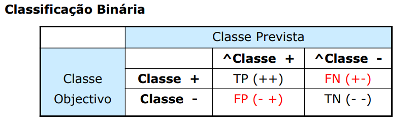

# Índice

- [Modelos Preditivos](#modelos-preditivos)
- [Avaliação de Modelos](#avaliação-de-modelos)

# Modelos Preditivos

## Aprendizagem Baseada em Instâncias (KNN)

- Conhecido como o método dos k-vizinhos mais próximos
- a previsão de valores (discretos/contínuos) é feita com base nos valores mais próximos
- Baseia-se em dois conceitos:
    - Distância entre 2 registos
    - Combinação dos resultados através dos vizinhos
- Distância Euclidiana é usada para calcular a distância entre 2 pontos
- Normalização deve ser aplicada aos atributos
- Para uma função ser usada como distância as seguintes propriedades têm de ser válidas, para quaisquer p, q, d:
    - 
    - 1: A distância entre 2 pontos não pode ser negativa
    - 2: A distância de um ponto a ele próprio é nula
    - 3: A ordem dos pontos não afeta a distância entre eles (simetria)
    - 4: A distância entre dois pontos é sempre menor ou igual à soma das distâncias de um ponto intermediário (Desigualdade triangular)
- Escola do K
    - O valor deve ser ímpar
    - A escolha deve ser experimental (o k com os melhores resultados, será o k escolhido)
    - Valores pequenos de k -> podem aumentar a contribuição de exemplos ruidosos
    - Valores maiores de k -> podem aumentar a contribuição de exemplos pouco similares, ou seja, menos relevantes
-Vantagens/desvantagens: 

| Aspecto                              | Vantagens                                                                                        | Desvantagens                                                                                                |
| -------------------------------------|--------------------------------------------------------------------------------------------------|------------------------------------------------------------------------------------------------------------|
| Processamento de variáveis dependentes | Processa qualquer número de variáveis dependentes                                                 | Computacionalmente intensivo no cálculo das distâncias entre casos                                        |
| Tipo de previsão                      | Pode ser usada para prever valores contínuos ou discretos                                         | Os resultados dependem da função distância usada, da função combinação e do número de vizinhos usados      |
| Função de distância                   | Qualquer função de distância pode ser usada                                                       | Necessita de grandes conjuntos de treino                                                                    |
| Implementação fácil                   | Fácil de implementar                                                                             | Sensibilidade a valores isolados e variáveis irrelevantes                                                  |
| Atualização do modelo                 | Facilmente atualizado por expansão ou substituição do conjunto de treino                         | Ausência de qualquer modelo para "mostrar" ao utilizador                                                  |
| Compreensão dos resultados            | É fácil entender os resultados                                                                  |                                                                                                            |

## Aprendizagem Baseada em Probabilidades (Naive Bayes)

- Teoria Bayesiana -> Usa dados do passado para estimar probabilidades de eventos futuros
    - Requer probabilidades à priorio
- A teria Bayesiana faz 2 assunções:
    - Os atributos são todos igualmente importantes
    - Os atributos são estatisticamente independentes
- Teoria da Probabilidade
    1. **Espaço Amostral (S):** O conjunto de todos os resultados possíveis de um experimento aleatório é chamado de espaço amostral.

    2. **Evento (E):** Um evento é um subconjunto do espaço amostral, ou seja, é um conjunto de resultados possíveis.

    3. **Probabilidade de um Evento (P(E)):** A probabilidade de um evento é uma medida numérica que representa a chance relativa de o evento ocorrer. A probabilidade de um evento está sempre no intervalo de 0 a 1.
        - $$ 0 \leq P(E) \leq 1 $$

    4. **Regra da Soma:** Para quaisquer dois eventos mutuamente exclusivos (eventos que não podem ocorrer simultaneamente), a probabilidade da união dos eventos é a soma das probabilidades dos eventos individuais.
        - $$ P(A \cup B) = P(A) + P(B) $$,
         se \( A \) e \( B \) são mutuamente exclusivos.

    5. **Regra Geral da Soma:** A probabilidade de qualquer evento pode ser encontrada pela soma das probabilidades dos eventos individuais e subtraindo a probabilidade da interseção dos eventos, se houver.
        - $$ P(A \cup B) = P(A) + P(B) - P(A \cap B) $$

    6. **Probabilidade Condicional:** A probabilidade condicional de um evento \(A\) dado que ocorreu um evento \(B\) é denotada por \(P(A|B)\) e é definida como a probabilidade de \(A\) ocorrer, dado que sabemos que \(B\) ocorreu.
        - $$ P(A|B) = \frac{P(A \cap B)}{P(B)} $$

    7. **Regra do Produto:** A probabilidade da interseção de dois eventos, \(P(A \cap B)\), pode ser encontrada multiplicando a probabilidade de um evento pelo condicional do outro evento.
        - $$P(A \cap B) = P(A) \cdot P(B|A)$$

    8. **Eventos Independentes:** Dois eventos, \(A\) e \(B\), são independentes se a ocorrência (ou não ocorrência) de um evento não afeta a probabilidade do outro.
        - $$ P(A \cap B) = P(A) \cdot P(B) $$
- Classificador Bayesiano Naive (Ingénuo)
    - O **Classificador Bayesiano Naive** realiza a suposição ingênua, ou seja, assume que as variáveis \(a_1, a_2, ..., a_n\) são independentes. Seja \(v_j\) o valor do atributo a ser previsto para uma instância da amostra com \(n\) atributos preditivos \(a_1, a_2, ..., a_n\), a probabilidade do valor \(v_j\) do atributo a ser previsto é igual ao produto das probabilidades individuais de cada atributo.
    - 
    - 
-  Suposição Naive Bayes
    - O **Naive Bayes** assume independência condicional de classe, o que implica que os eventos são considerados independentes quando condicionados ao mesmo valor de classe.
- Problemas do Classificador Bayesiano
    - Se a probabilidade condicional de um atributo for nula, a probabilidade da classe também será nula.

    - Se os exemplos de treino não cobrirem todos os valores possíveis dos atributos, a classificação de determinados registros pode se tornar impossível.
- Estimativa de Laplace
    - O problema anterior pode ser resolvido, usando a **estimativa de Laplace**
    - O **estimador de Laplace** envolve adicionar uma pequena quantidade a cada uma das contagens na tabela de frequência, garantindo que cada característica tenha uma probabilidade não nula. Geralmente, o estimador de Laplace é ajustado para 1, assegurando que cada combinação de características da classe esteja presente nos dados pelo menos uma vez.
- Teorema de Bayes
    - O **Teorema de Bayes** aplicado como classificador requer o conhecimento de:

    - Duas probabilidades a priori: \(P(\text{decisão}_i)\).
    - Uma probabilidade condicional: \(P(x|\text{decisão}_i)\).

    - Este classificador é ótimo no sentido de que, em média, nenhum outro classificador pode obter melhores resultados usando a mesma informação. No entanto, na prática, essas probabilidades são desconhecidas.

    - Estimar confiavelmente essas probabilidades a partir de um conjunto de exemplos requer um número infinito de exemplos.

    - São feitas simplificações no cálculo de \(P(x|\text{decisão})\), assumindo que os atributos são independentes da decisão.

    - O **Classificador Bayesiano Naive** é uma aplicação prática desse teorema, assumindo a independência condicional entre os atributos.
- Probabilidades a partir de Atributos Contínuos
    - Para lidar com atributos contínuos, é comum:

    - **Discretizar:**
        - Realizar uma partição baseada em dois valores, como \( (A < v) \) ou \( (A > v) \).

    - **Estimativa baseada na densidade de Probabilidade:**
        - Assume-se que o atributo segue uma distribuição normal ou binomial.
        - Utiliza-se a amostra para estimar os parâmetros da distribuição, como média (\(\mu\)) e desvio padrão (\(s\)).
    - Estima-se a probabilidade condicional \(P(A_i|c)\) usando a fórmula:

    $$ P(A_i|c) = \frac{1}{\sqrt{2\pi s^2}} \exp\left(-\frac{(A_i - \mu)^2}{2s^2}\right) $$

    - onde:
        - \(\mu\) é a média.
        - \(s\) é o desvio padrão.
        - \(A_i\) é o valor do atributo contínuo.

    Essa abordagem permite trabalhar com atributos contínuos no contexto do Classificador Bayesiano Naive, assumindo uma distribuição conhecida e estimando seus parâmetros a partir dos dados amostrais.
- Vantagens/Desvantagens:

| **Vantagens**                                  | **Desvantagens**                                      |
| ---------------------------------------------- | ------------------------------------------------------ |
| 1. Robusto no tratamento de valores isolados    | 1. Cálculo de um número elevado de probabilidades      |
| 2. Robusto no tratamento de atributos irrelevantes | 2. Necessidade de amostras suficientemente representativas (elevada dimensão) |
| 3. Fácil de implementar                        | 3. Suposição de independência condicional               |
| 4. Capaz de classificar amostras com valores ausentes | 4. Não capta dependências entre variáveis               |
| 5. Considera todos os atributos como igualmente importantes | 5. Desempenho pode ser afetado pela presença de atributos correlacionados |
| 6. Complexidade computacional linear em todas as variáveis do problema |                                                      |

# Avaliação de Modelos

- Estimativa de Desempenho:
    - Obter uma estimativa fiável do erro de previsão
    - Devemos Repetir os testes várias vezes
    - Estimativa final = média de estimativas individuais
    - Os dados utilizados para avaliação de qualquer modelo não podem ser usados durante o desenvolvimento do modelo
- Métodos:
    - Holdout
        - Dividir os dados (aleatóriamente) em 2 conjuntos diferentes:
            - Treino -> 2/3 do conjunto inicial
                - Maior o conjunto = melhor o modelo
            - Teste ->  1/3 do conjunto inicial
                - Maior o conjunto = mais fiável a estimativa de erro
        - Limitações:
            - Só é possível aplicar quando existe um grande número de dados e todas as classes estiverem bem representadas
            - O modelo é altamente dependente da composição dos conjuntos
            - Os conjuntos de treino e teste não são independentes
    - Holdout Repetido
        - O método holdout pode ser repetido várias vezes em ordem a melhorar a estimativa do desempenho do modelo
    - Cross-Validation
        - A validação cruzada é uma técnica importante na avaliação de modelos de machine learning. Consiste em dividir o conjunto de dados em K partições (folds), treinando o modelo em K-1 folds e avaliando-o no fold restante. Esse processo é repetido K vezes, garantindo que cada parte dos dados seja usada tanto para treinamento quanto para avaliação. 
        - O erro do modelo é então calculado como a média dos erros de previsão obtidos nas K iterações da validação cruzada. Essa abordagem ajuda a fornecer uma avaliação mais robusta do desempenho do modelo, reduzindo o impacto de uma única divisão inadequada dos dados.
        - A validação cruzada é essencial para evitar a superestimação ou subestimação do desempenho do modelo, fornecendo uma visão mais confiável sobre como o modelo generaliza para diferentes conjuntos de dados.
    -  Vantagens da Validação Cruzada
        - **Utiliza o máximo de dados possível para treino:** A validação cruzada permite que o modelo seja treinado com o máximo de dados disponíveis, o que é crucial para desenvolver modelos mais robustos e generalizados.
        - **Conjuntos de teste mutuamente exclusivos - cobrem todo o conjunto de dados:** A abordagem de validação cruzada garante que todos os dados sejam utilizados tanto para treinamento quanto para teste. Isso é fundamental para avaliar o desempenho do modelo em diferentes partes do conjunto de dados, garantindo uma avaliação abrangente.
        - **Estratificação reduz a variância das estimativas:** A estratificação, quando aplicada na validação cruzada, ajuda a reduzir a variância das estimativas do modelo. Isso significa que as métricas de desempenho são mais consistentes e confiáveis, mesmo quando o conjunto de dados pode ter variações significativas.
    - Leave One out
        - Em cada iteração um único caso é deixado fora do conjunto de treino
        - Na sua essência, é semelhante a VC com n-fold vezes
        - Na Validação Cruzada Leave-One-Out, para uma amostra de tamanho n, o modelo é treinado em n-1 exemplos e testado com o exemplo excluído. Esse processo é repetido n vezes, onde o erro é a soma dos erros em cada teste dividido por n.

            - **Amostragem não estratificada:** O teste é realizado apenas em um exemplo por vez, sem considerar estratificação nas classes.

            - **Procedimento determinístico:** Não há amostragem aleatória envolvida, tornando o procedimento determinístico.

            - **Computacionalmente dispendioso:** Esta abordagem é adequada para amostras muito pequenas devido à sua natureza computacionalmente custosa.

            - **Estimativa do desempenho do modelo com elevada variância:** Como o teste ocorre em um único exemplo por vez, a estimativa do desempenho do modelo pode ter uma variância elevada.
    - Bootstrap
        - No método de bootstrap, um conjunto de treino é formado selecionando n instâncias do conjunto inicial de dados com reposição, o que implica que, para grandes amostras, o conjunto de treino terá aproximadamente 63.2% das instâncias originais devido à probabilidade de seleção com repetição.
        - O conjunto de teste, formado pelas instâncias não selecionadas para o conjunto de treino (out-of-bag samples), em um método bootstrap é composto por aproximadamente 36.8% das instâncias originais para grandes amostras, sendo esse procedimento de amostragem repetido k vezes para obter uma estimativa final do erro.
- Que método usar e Quando?
    - Para grandes conjuntos de dados, o método mais adequado é o Holdout repetido.
    - Em conjuntos de dados de tamanho médio, k-fold (especialmente com k=10) é frequentemente escolhido, sendo comum repetir o processo k-fold várias vezes para aumentar a significância estatística e diminuir a variância.
    - A subamostragem aleatória é uma opção, embora menos frequentemente utilizada.
    - Para pequenos conjuntos de dados, Bootstrap e leave-one-out são escolhas comuns, sendo o Bootstrap a opção mais frequente com um grande número de repetições (por exemplo, 200).
- Avaliação de Modelos Regressão
    - 2 tipos de erros de previsão:
        - Erros dependentes da escala
        - Erros percentuais

 

- Matriz de confusão
    - 
    - Possuímos 4 classes/tipos de previsões:
        - TP -> True Positives, aka, dados previstos como positivos e são, na realidade, positivos
        - FP -> False Positives, aka, dados previstos como positivos, mas na realidade são negativos
        - TN -> True Negatives, aka, dados previstos como Negativos e são, na realidade, negativos
        - FN -> False Negatives, aka, dados previstos como negativos, mas, na realidade, são positivos
- Métricas para avaliação de desempenho
    - Accuracy:
        - Número de previsões corretas em relação ao nº total de previsões realizadas
        - Accuracy = (TP + TN) / (TP + TN + FP + FN)
        - O erro associado pode ser calculado subtraíndo a 1, a accuracy obtida
        - Taxa de erro = 1 - accuracy
    - Kappa
        - Avalia se a accuracy foi gerada aleatóriamente
        - 
        - Uma interpretação comum da estatística Kappa:
            - Menor que 0.20: Acordo Pobre
            - Entre 0.20 e 0.40: Acordo Fraco
            - Entre 0.40 e 0.60: Acordo Moderado
            - Entre 0.60 e 0.80: Bom Acordo
            - Entre 0.80 e 1.0: Muito Boa Concordância
    - Limitações da Accuracy:
        - Todas as classes previstas têm a mesma importância, logo não é adequada
        - especialmente para conjuntos de dados desbalanceados
        - classes com custos diferentes
    - Matrizes de custos
        - Usadas para calcular o custo associado às previsões realizadas por um modelo
        - Exemplo:
            -     
        - Esxitem métricas sensíveis ao custo:
            - Recall -> taxa de acerto na classe positiva
            - Specificity -> taxa de acerto na classe negativa
    - Taxa de Acerto Balanceada
        - Balanced Accuracy = (recall + specificity) / 2
    - Precision
        - Percentagem de previsões **positivas** corretas
            - precision = (TP)/(TP+FP)
    - Recall
        - Percentagem de exemplos positivos corretamente previstos
            - recall = (TP)/(TP + FN)
    - F1
        - Medida harmónica ponderada entre a precision e recall
            - F1 = $$ 2 * \frac{\text{Precision} \cdot \text{Recall}}{\text{Precision} + \text{Recall}}$$
    - Classificação Multi-Classe
        - Não existe classe positiva e negativa
        - Existem n-matrizes binárias, uma para cada classe
        - desempenho global é calculado através de medidas micro e macro-média
        - 
- Como comparar o desempenho de vários modelos?
    - Accuracy por si não chega, eis um exemplo que demonstra tal:
        - Dados dois modelos:
            - Modelo M1: Precisão (Accuracy) de 85%, avaliado em 30 instâncias.
            - Modelo M2: Precisão (Accuracy) de 75%, avaliado em 5000 instâncias.

       - A comparação direta entre M1 e M2 com base na precisão isoladamente não é suficiente para determinar qual é melhor, pois a quantidade de instâncias testadas também é um fator relevante. Para uma avaliação mais robusta, seria necessário considerar outras métricas ou contextos específicos de aplicação.
    - Curva ROC e AUC
        - A Curva ROC (Receiver Operating Characteristic) e a AUC (Área Sob a Curva) são métricas eficazes para comparar modelos em diferentes pontos de operação. Estas métricas fornecem uma representação visual da taxa de verdadeiros positivos em função da taxa de falsos positivos, permitindo a análise do desempenho do modelo em diversos limiares de classificação. A AUC, que representa a área sob a curva ROC, oferece uma medida agregada da capacidade discriminativa do modelo, sendo uma métrica útil para avaliar e comparar classificadores.
    - 

 

 

