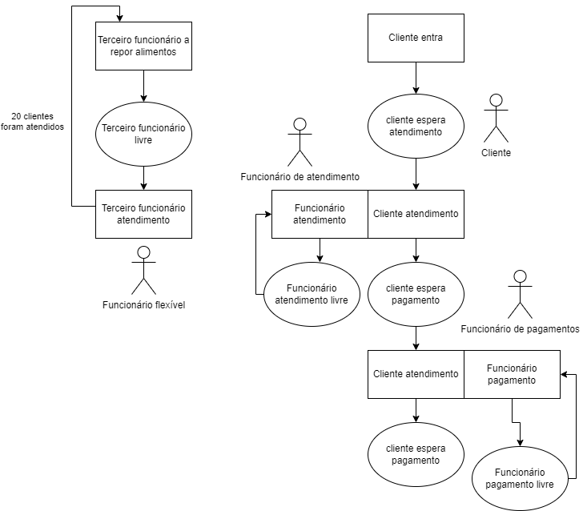
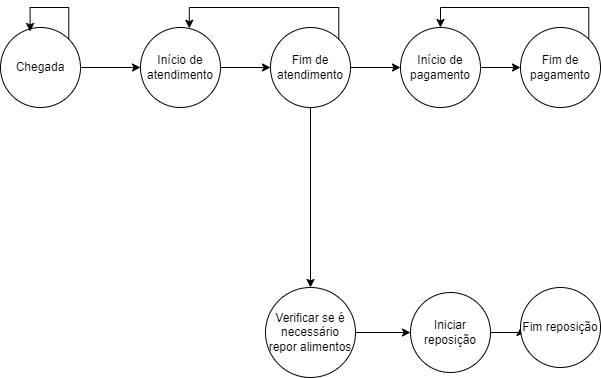
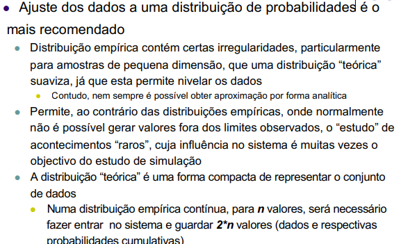
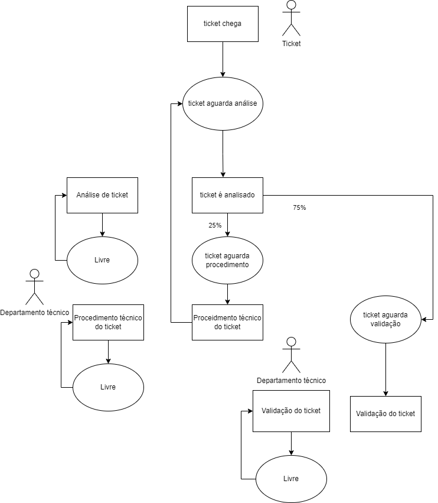
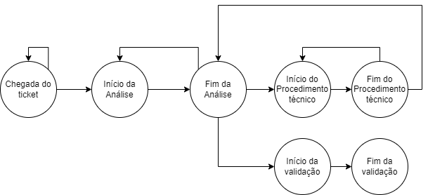

# Exames de MODSS (Tentativas de resolução)


## Index
- [Exame 22-23 normal](#exame-22-23-normal-resolvido-no-documento)
- [Exame 21-22 normal](#exame-21-22-normal)


## Exame 22-23 Normal (resolvido no documento)

## Exame 21-22 (normal)

#### a)
Entidades : Cliente e funcionários. Existem 3 funcionários:
- 1 dedicado ao taendimento
- 1 dedicado aos paagmentos
- 1 que é flexível, ou seja,
    - trata da reposição de alimentos quando é necessário
    - se estiver livre e existirem clientes à espera, ajuda no atendimento de clientes

Atividades: 
- Chegada de clientes
- Atendimento do cliente
- Pagamento
- Reposição de alimentos
- Saída de clientes (fim)

Ciclo de atividades:



#### b)
Eventos necessários à simulação do sistema:
- Chegada de clientes
- Início do atendimento
- Fim do atendimento
- Início do Pagamento
- Fim do Pagamento
- Necessidade de repor alimentos
- Início de reposição de alimentos
- Fim da reposição de alimentos
- Saída de clientes(?)

Grafo de eventos: 

Rotinas necessárias:
1. Rotina de Chegada de Cliente 
    - Gera o evento de chegada do próximo cliente.
    - Coloca o cliente na fila de atendimento ou inicia o atendimento se um funcionário estiver disponível.

2. Rotina de Início do Atendimento
    - Inícia o atendimento do cliente
    - Agenda o término do atendimento
3. Rotina de fim de pagamento
    - Termina o atendimento de um cliente
    - Redireciona o cliente para a fila de pagamento
    - Verifica se há necessidade de reposição de alimentos
    - Funcionário fica livre
4. Rotina de Início de pagamento
    - Inícia o pagamento do cliente
    - Agenda o evento de término de pagamento
5. Rotina de Fim de Pagamento
    - Termina o pagamento do cliente
    - O cliente sai
6. Rotina de necessidade de reposição de alimentos
    - Determina a necessidade de repor alimentos após 20 clientes terem sido atendidos
7. Rotina de início de reposição
    - Inícia a reposição de alimentos
    - Agenda o evento de término da reposição
8. Rotina de fim de Reposição de alimentos
    - Termina a reposição de alimentos
    - Liberta o funcionário flexível

#### c)

Atendimento de clientes, estes chegam, são atendidos e depois pagam.

- Chegada de clientes
```
function Arrival_Event(current_time):
    Generate next_arrival_time = current_time + Exponential(2 minutes)
    Schedule_Event(Arrival_Event, next_arrival_time)
    
    if Atendimento_Queue is empty and Atendimento_Worker is free:
        Start_Service(current_time)
    else:
        Add client to Atendimento_Queue

```

- Início do atendimento
```
function Start_Service(current_time):
    if Atendimento_Queue is not empty:
        Remove client from Atendimento_Queue
        Atendimento_Worker = busy
        
        Service_Time = Exponential(4 minutes)
        End_Service_Time = current_time + Service_Time
        Schedule_Event(End_Service_Event, End_Service_Time)

```
- Fim do Atendimento
```
function End_Service_Event(current_time):
    Atendimento_Worker = free
    
    if Pagamento_Queue is empty and Pagamento_Worker is free:
        Start_Payment(current_time)
    else:
        Add client to Pagamento_Queue
    
    if number_of_clients_served % 20 == 0:
        Schedule_Event(Need_Refill_Event, current_time)
    
    if Atendimento_Queue is not empty:
        Start_Service(current_time)

```
- Início do pagamento
```
function Start_Payment(current_time):
    if Pagamento_Queue is not empty:
        Remove client from Pagamento_Queue
        Pagamento_Worker = busy
        
        Payment_Time = Uniform(50 seconds, 130 seconds)
        End_Payment_Time = current_time + Payment_Time
        Schedule_Event(End_Payment_Event, End_Payment_Time)

```
- Fim do pagamento
```
function End_Payment_Event(current_time):
    Pagamento_Worker = free
    
    if Pagamento_Queue is not empty:
        Start_Payment(current_time)

```


#### d)

Medidas de desempenho:
- Tempo médio de espera dos clientes (atendimento)
- Tempo médio de espera dos clientes (pagamentos)
- Tempo total de permanência dos clientes
- Uso dos funcionários
- Número médio de clientes em espera


Cenários alternativos a explorar:
1. Utilizar mais funcionários
2. Melhorar sistema de pagamento (permitir self-pay)

#### e)



#### f)

Fontes de aleatoridade:
- Tempo de chegada dos clientes
- Tempo de atendimento dos clientes
- Tempo de pagamento
- Tempo de reposição de alimentos

Justificação -> Estas fontes de aleatoriedade são fundamentais para capturar a variabilidade real do sistema. Elas afetam diretamente a dinâmica do fluxo de clientes, a utilização dos funcionários, e a eficiência geral do restaurante. Modelar essas variáveis de forma aleatória permite simular o comportamento do sistema de forma mais realista, considerando as flutuações e incertezas que ocorrem naturalmente no ambiente operacional.

#### g)


Dps adiciono os cálculos todos, mas o intervalo de confiança dá isto:
(1,572,2,332)

Conclusão
- Com base nos cálculos, podemos concluir que com 95% de confiança, a média do atraso total por automóvel está entre 1,572 e 2,332 minutos. Esta informação pode ser usada para avaliar a eficiência do sistema atual e considerar melhorias. Se os atrasos observados são aceitáveis dentro deste intervalo, o sistema pode estar operando de forma eficiente. Caso contrário, pode ser necessário implementar mudanças para reduzir os atrasos.


#### h)


- Significado do Intervalo de Confiança:
    - O intervalo de confiança [0,150; 0,378] representa a faixa dentro da qual a diferença média entre a taxa de utilização dos recursos nos dois cenários (Cen1 - Cen2) está localizada com 95% de confiança.
    - Como o intervalo não inclui zero, podemos inferir que há uma diferença estatisticamente significativa entre os dois cenários.
- Positividade do Intervalo:

    - Todo o intervalo de confiança é positivo (0,150 a 0,378), indicando que a taxa de utilização dos recursos em Cen1 é, em média, maior do que em Cen2.
    - Isso sugere que o cenário Cen1 resulta em uma maior utilização dos recursos comparado ao cenário Cen2.

- Conclusões e Decisão
- Se o objetivo é maximizar a utilização dos recursos:

    - Se o responsável pelo sistema deseja aumentar a taxa de utilização dos recursos, Cen1 é preferível, pois resulta consistentemente em uma maior utilização dos recursos em comparação com Cen2.
    - A diferença positiva significa que a implementação de Cen1 aproveita melhor os recursos disponíveis, mantendo-os ocupados por mais tempo.
- Se o objetivo é minimizar a sobrecarga e evitar a utilização excessiva dos recursos:

    - Se o objetivo é reduzir a carga sobre os recursos para evitar a exaustão ou melhorar a qualidade do serviço, Cen2 pode ser preferível.
    - Uma utilização excessiva pode levar a fadiga dos funcionários ou a diminuição da qualidade do atendimento, então, Cen2 pode oferecer um melhor equilíbrio entre eficiência e qualidade do serviço.

- Justificação
    - Estatística Significativa: O intervalo de confiança não inclui zero, indicando que a diferença observada é estatisticamente significativa e não devida ao acaso.
    - Objetivos do Sistema: A escolha entre os cenários deve ser guiada pelos objetivos estratégicos do sistema. Se a prioridade é aumentar a eficiência e utilização dos recursos, Cen1 é preferível. Se a prioridade é evitar a sobrecarga e melhorar a qualidade do serviço, Cen2 é a melhor opção.
- Resumo
    - Com base no intervalo de confiança [0,150; 0,378], concluímos que Cen1 resulta em uma maior utilização dos recursos em comparação com Cen2. A decisão de qual cenário adotar deve ser baseada nos objetivos operacionais do sistema:

    - Maximizar Utilização: Adotar Cen1.
    - Minimizar Sobrecarga: Adotar Cen2.


#### i)

### Digital Twins (DTs) vs. Simulação

#### Definição e Relação

**Digital Twins (DTs)**:
- **Definição**: Um Digital Twin é uma réplica digital de um ativo físico, sistema ou processo. Ele é atualizado continuamente com dados em tempo real e pode simular o comportamento do seu gêmeo físico.
- **Relação com a Simulação**: Um DT utiliza técnicas de simulação para prever o comportamento futuro e otimizar a operação e manutenção do ativo físico. A simulação é uma componente crucial dos DTs, permitindo análises preditivas e o teste de diferentes cenários.

**Simulação**:
- **Definição**: Simulação é a imitação do funcionamento de um processo ou sistema do mundo real ao longo do tempo. Utiliza modelos matemáticos, estatísticos e algoritmos para representar e analisar o comportamento de um sistema.
- **Relação com DTs**: A simulação pode ser usada independentemente para estudar sistemas e processos, mas em um DT, ela é integrada e interligada continuamente ao seu correspondente físico, com dados reais alimentando os modelos em tempo real.

#### Diferenças

1. **Conectividade com o Mundo Real**:
   - **DTs**: Estão conectados em tempo real com seu ativo físico, recebendo dados continuamente e refletindo o estado atual do ativo.
   - **Simulação**: Normalmente, não é em tempo real e pode ser desconectada do ativo físico. Utiliza dados históricos ou hipotéticos para realizar análises.

2. **Finalidade e Uso**:
   - **DTs**: Usados para monitoramento contínuo, previsão, manutenção preditiva, e otimização em tempo real de ativos físicos.
   - **Simulação**: Utilizada para estudar o comportamento de sistemas sob diferentes condições, testar hipóteses, e entender possíveis impactos de mudanças antes de implementá-las.

3. **Atualização de Dados**:
   - **DTs**: Atualizados constantemente com dados em tempo real do ativo físico.
   - **Simulação**: Baseada em um conjunto fixo de dados que pode ser atualizado, mas geralmente não de forma contínua ou em tempo real.

4. **Escopo e Escalabilidade**:
   - **DTs**: Projetados para refletir e operar um ativo específico ou um conjunto de ativos específicos em detalhes.
   - **Simulação**: Pode ser aplicada a sistemas de qualquer escala, desde pequenos processos até grandes sistemas complexos, sem a necessidade de uma réplica física.

#### Vantagens dos Digital Twins

1. **Monitoramento em Tempo Real**:
   - Fornece uma visão contínua e atualizada do estado do ativo físico, permitindo uma melhor gestão e resposta rápida a problemas.

2. **Manutenção Preditiva**:
   - Ao analisar os dados em tempo real, os DTs podem prever falhas antes que ocorram, reduzindo o tempo de inatividade e os custos de manutenção.

3. **Otimização Contínua**:
   - Permite a otimização em tempo real dos processos e sistemas, ajustando as operações para eficiência máxima.

4. **Simulação de Cenários**:
   - Permite testar diferentes cenários e estratégias em um ambiente virtual antes de implementá-las no mundo real, minimizando riscos.

#### Desvantagens dos Digital Twins

1. **Complexidade e Custo**:
   - A criação e manutenção de DTs pode ser complexa e cara, exigindo investimento significativo em tecnologia e infraestrutura.

2. **Integração de Dados**:
   - Integrar dados de diferentes fontes e garantir a precisão e a atualização contínua pode ser desafiador.

3. **Segurança e Privacidade**:
   - O uso de dados em tempo real e a conexão contínua ao ativo físico aumentam os riscos de segurança cibernética e preocupações com privacidade.

#### Vantagens da Simulação

1. **Flexibilidade e Escalabilidade**:
   - Pode ser aplicada a uma ampla gama de sistemas e processos, de qualquer tamanho e complexidade.

2. **Custo-efetividade**:
   - É geralmente menos dispendiosa do que a criação de DTs, pois não requer conectividade em tempo real e pode ser realizada com conjuntos de dados fixos.

3. **Testes sem Risco**:
   - Permite a experimentação e o teste de hipóteses em um ambiente controlado sem riscos para o mundo real.

#### Desvantagens da Simulação

1. **Desconexão com o Mundo Real**:
   - Pode não refletir as condições reais e atuais do sistema, uma vez que não está conectada em tempo real ao ativo físico.

2. **Dados Desatualizados**:
   - Baseia-se em dados históricos ou hipotéticos, o que pode levar a previsões imprecisas se as condições mudarem.

3. **Limitações de Precisão**:
   - Modelos de simulação podem simplificar a realidade, resultando em resultados menos precisos ou detalhados.

### Conclusão

**Digital Twins** e **Simulação** são ferramentas poderosas para a análise e otimização de sistemas. DTs, com sua capacidade de conectar-se em tempo real a ativos físicos, oferecem uma vantagem significativa em termos de monitoramento contínuo, manutenção preditiva e otimização dinâmica. No entanto, isso vem com maior complexidade e custo. A simulação, por outro lado, oferece flexibilidade, escalabilidade e uma abordagem menos dispendiosa para testar e analisar sistemas, mas pode não ser tão precisa ou atualizada como um DT.

A escolha entre usar DTs ou simulação depende dos objetivos específicos, recursos disponíveis e a complexidade do sistema em questão. Muitas vezes, uma abordagem combinada pode ser a mais benéfica, utilizando DTs para monitoramento e otimização em tempo real e simulação para análise detalhada e planejamento estratégico.


## Exame 20-21 (normal)

#### a)
| Entidade  | Estado  |   
|---|---|
| Ticket  | Novo; Em análise; Em procedimento técnico; Em validação; encerrado  |    
|  Departamento técnico | Disponível; ocupado  |  


Atividades:

|Atividade| Descrição|Entrada|Saída|Tempo|Pré-condições|Pós-condições|
|---|---|---|---|---|---|---|
| Receber ticket |Ticket novo |Receção de um novo ticket  | Ticket com Status "novo"  |exponencial (3 min)  |nenhuma  | ticket disponível para análise |  
| Analisar ticket | Análise inicial do ticket |ticket com status novo  | ticket com status "em procedimento" ou "em validação"|20-120 segundos  |ticket deve estar no estado novo  | ticket encaminhado para procedimento técnico ou validação |   
| Procedimento técnico |Realização do procedimento técnico  |ticket com status " em procedimento técnico"  | ticket com status "em análise" | Exponencial (5 min)  | ticket deve estar no estado "em procedimento técnico"  | ticket volta para a análise  |  
| Validar ticket |Validação do ticket  | ticket com status "em validação"  |ticket com status "encerrado"  | exponencial (2 min)  | ticket tem de estar no estado "em validação"  | ticket é encerrado |  


Ciclo de atividades: 


#### b)

Eventos

1. **Chegada de Ticket (ChegadaTicket)**
   - Ocorre quando um novo ticket chega ao sistema.
   - Gera o próximo evento de chegada de ticket.

2. **Início da Análise de Ticket (InicioAnalise)**
   - Ocorre quando um ticket é selecionado para análise.

3. **Fim da Análise de Ticket (FimAnalise)**
   - Ocorre quando a análise de um ticket é concluída.
   - Decide se o ticket vai para o procedimento técnico ou para a validação/encerramento.

4. **Início do Procedimento Técnico (InicioProcedimentoTecnico)**
   - Ocorre quando um ticket necessita de procedimento técnico e é encaminhado ao departamento técnico.

5. **Fim do Procedimento Técnico (FimProcedimentoTecnico)**
   - Ocorre quando o procedimento técnico é concluído e o ticket retorna para a análise.

6. **Início da Validação/Encerramento (InicioValidacaoEncerramento)**
   - Ocorre quando um ticket é encaminhado para a validação/encerramento.

7. **Fim da Validação/Encerramento (FimValidacaoEncerramento)**
   - Ocorre quando a validação/encerramento de um ticket é concluída.

Grafo de eventos: 


#### c)

Chegada de ticket
```
Evento ChegadaTicket
    NovoTicket = CriarTicket()
    AgendarEvento(InicioAnalise, TempoAtual)
    AgendarEvento(ChegadaTicket, TempoAtual + DistribuicaoExponencial(3 minutos))
FimEvento
```

Inicio de analise
```
Evento InicioAnalise(Ticket)
    AgendarEvento(FimAnalise, TempoAtual + TempoUniforme(20 segundos, 120 segundos), Ticket)
FimEvento
```

Fim de analise
```
Evento FimAnalise(Ticket)
    Se DistribuicaoUniforme(0, 1) < 0.25 Então
        // 25% dos tickets vão para o procedimento técnico
        AgendarEvento(InicioProcedimentoTecnico, TempoAtual, Ticket)
    Senão
        // 75% dos tickets vão para validação/encerramento
        AgendarEvento(InicioValidacaoEncerramento, TempoAtual, Ticket)
    FimSe
FimEvento
```


Inicio de procedimento
```
Evento InicioProcedimentoTecnico(Ticket)
    AgendarEvento(FimProcedimentoTecnico, TempoAtual + DistribuicaoExponencial(5 minutos), Ticket)
FimEvento
```


Fim de procedimento
```
Evento FimProcedimentoTecnico(Ticket)
    AgendarEvento(InicioAnalise, TempoAtual, Ticket)
FimEvento
```


Inicio de validação
```
Evento InicioValidacaoEncerramento(Ticket)
    AgendarEvento(FimValidacaoEncerramento, TempoAtual + DistribuicaoExponencial(2 minutos), Ticket)
FimEvento
```

Fim de validação
```
Evento FimValidacaoEncerramento(Ticket)
    EncerrarTicket(Ticket)
FimEvento
```


#### d)
Medidas de desempenho:
- Tempo de resolução (tempo desde que chega e encerra o ticket)
- Tempo médio de espera nas filas
- Número médio de tickets em espera

Cenários alternativos:
1. Adicionar mais técnicos ao departamento técnino
2. Implementação de um sistema de prioridades em relação aos tickets


#### e)
Eis as caraceterísticas importantes de um bom gerador de números alestórios:
- Os números devem parecer uniformemente
distribuídos no intervalo [0,1], e não devem exibir
correlação entre eles, caso contrário os resultados
da simulação podem ser completamente inválidos
- Do ponto de vista da utilização prática, devem ser
rápidos e não exigir grande memória para
armazenamento
- Será desejável conseguir reproduzir a mesma
sequência de números aleatórios
    - Debug e verificação de resultados
    -  Comparar diferentes sistemas, ou configurações de um
mesmo sistema, com os mesmos dados
- Deve permitir gerar várias sequências
independentes de números
    - Utilizador pode assim dedicar cada sequência a uma fonte de aleatoriedade da simulação
    - Usar sequências independentes para representar
diferentes aspectos facilita a reprodução e comparação de
resultados


#### f)

Passos a seguir:
1. Calcular a diferença entre cada par de observações.

Diferença = Sistema - simulação
D=[0.10,−0.04,−1.00,0.54,−0.59,0.09,0.19,0.10,0.50,0.90]

2. Calcular a média e o desvio padrão das diferenças.

Calcular a média das diferenças

D_average = 0.078

Desvio padrao = 0.548


3. Calcular o valor do teste t.

 $$
   t = \frac{\bar{D}}{S_D / \sqrt{n}} = \frac{0.079}{0.548 / \sqrt{10}} \approx 0.456
   $$


4. Determinar os graus de liberdade.

Os graus de liberdade (df) para este teste são 
𝑛
−
1
n−1, onde 
𝑛
n é o número de pares.

$$
   df = 9
   $$
5. Comparar o valor do teste t com o valor crítico de t para a confiança de 95%

$$
   t_{crit} = 2.262
   $$


- Interpretação dos Resultados
    - Para uma confiança de 95%, com 9 graus de liberdade, o valor crítico de t é aproximadamente 2.262.

    - O valor calculado de t (0.456) é muito menor do que o valor crítico de t (2.262). Portanto, a diferença média entre os atrasos no sistema e na simulação não é estatisticamente significativa ao nível de confiança de 95%.

- Conclusão
    - Com base nos dados das 10 corridas de simulação, não há evidências suficientes para concluir que há uma diferença significativa entre os valores médios do atraso total por automóvel no sistema e nos resultados da simulação. Em outras palavras, a simulação parece estar alinhada com o comportamento observado no sistema real, considerando a margem de erro aceitável.

#### g)

Esta pergunta é realtiva a cada grupo, mas no meu caso:
- Tempos de espera: registo, consulta, observação, cirurgia, tratamento, emergência, e mais alguns