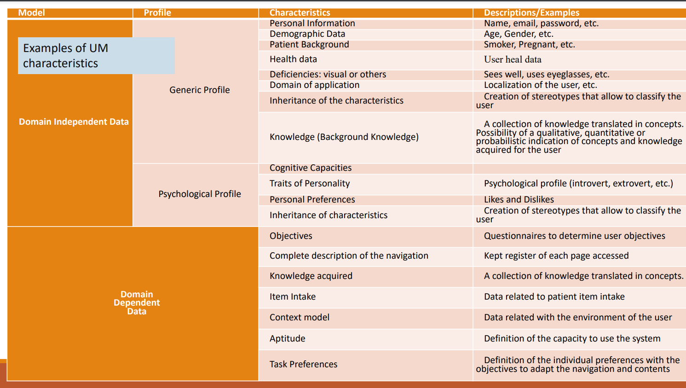
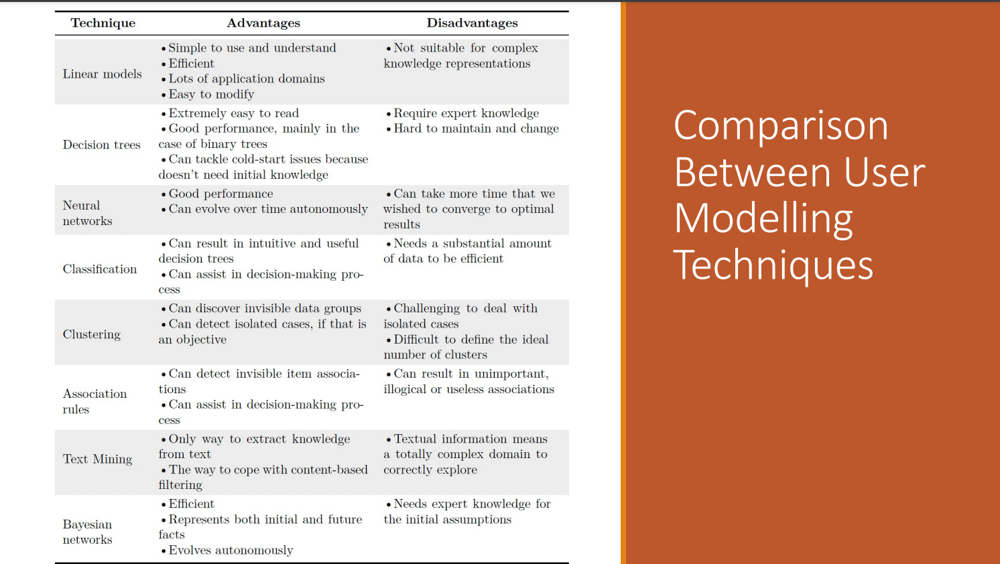
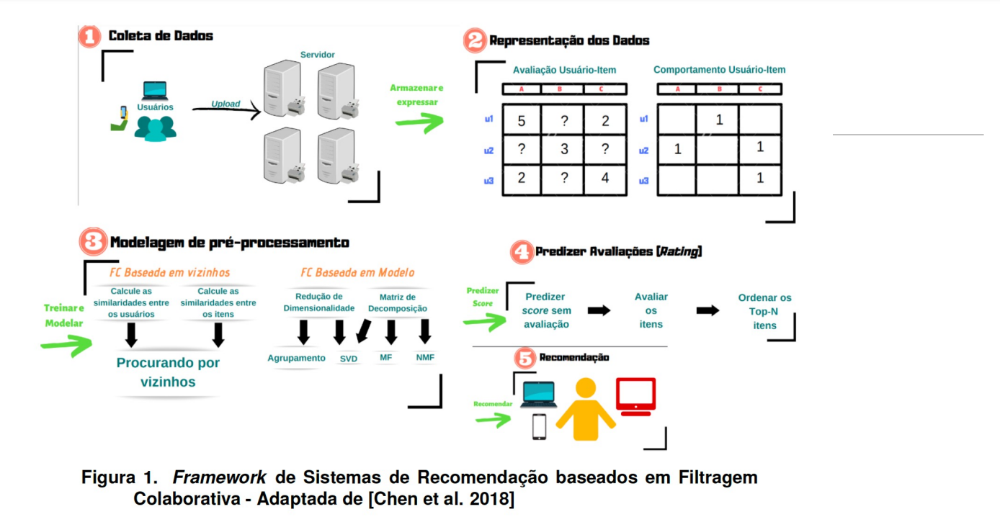
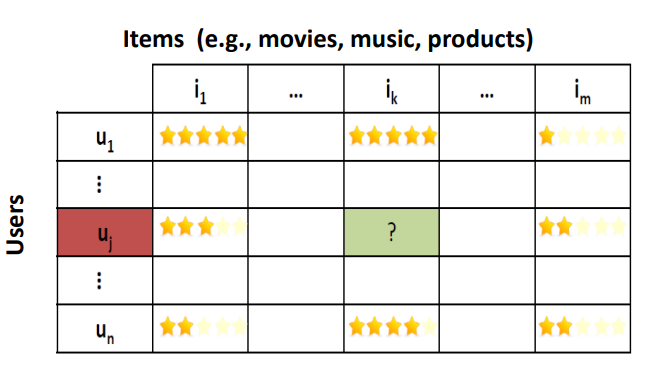
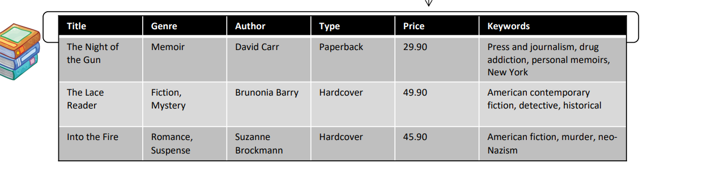
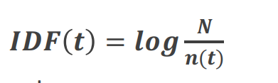
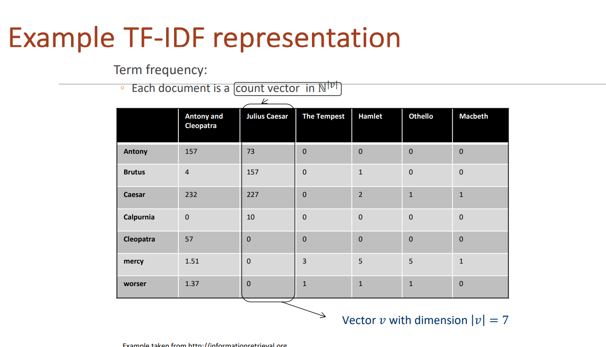

# Resumo da matéria para o exame

## Index
- [Sistemas de recomendação](#sistemas-de-recomendação-overview)
- [User modelling](#user-modelling)
- [Collaborative filtering](#collaborative-filtering)
- [Content-based](#content-based-filtering)
-

## Sistemas de recomendação overview

#### Qual o objetivo destes sistemas?
- Recomendar algo ao utilizador.
    - Por exemplo:
        - Que produto eletrónico devo comprar?
        - Que música devo ouvir?
        - Que série devo ver?

- Para recomendar itens a um utilizador, este deve ser estudado.
    - Podem existir utilizadores semelhantes, dos quais podemos obter recomendações 
        - No fundo, pessoas parecidas gostam de coisas iguais
    - Descobrir padrões no histórico de um utilizador
    - Descobrir as suas preferências

#### Non-personalized systems

- Em certas alturas, não possuímos conhecimento de um utilizador:
    - Conta recente
    - Utilizador não possui conta (apenas um visitante)
    - etc
- Devido a tal, devem ser implementados sistemas não personalizados
    - Em vez de métricas relacionadas com utilizadores, as suas preferências,  histórico, terão de usados critérios genéricos
        - Como por exemplo: Popularidade
    - Estes sistemas são mais fáceis de implementar
    Apesar de tudo, estas recomendações não têm nenhum nível de especificidade, logo um sistema de personalizado deve ser desenvolvido

#### Sistemas de recomendação

- Abordagens principais:
    - Filtragem colaborativa
        - Pessoas parecidas gostam das mesmas coisas
    - Content-based
        - Usar todos os detalhes associados ao conteúdo consumido/visualizado pelo utilizador para descobrir e recomendar itens semelhantes
    - Knowledge-based
        - Através de conhecimento do utilizador, iremos fornecer recomendações personalizadas
            - Saber as preferências do utilizador, o que ele gosta e não gosta, etc

#### Hybrid recommenders

- Apesar de existirem várias abordagens para recomendar items, também podemos combinar as mesma, melhorando a qualidade das nossas recomendações

#### Limitações e problemas nos sistemas de recomendação

- Black-sheep
    - No fundo, representam utilizadores com preferências e gostos bastantes diferentes da populção geral, que é difícil arranjar outros utilizadores semelhantes
- Cold start
    - O utilizador é recente e ainda não se possui muita ou alguma informação acerca do mesmo
- Comunity cold start
    - Cold start, mas o recommender é recente, logo nãi existem grandes dados, de forma genérica
- Item cold start
    - Item é novo, logo tem poucos ratings ou nenhum
- Dynamic personalization
    - No fundo, é o cold start. User é novo, não sabemos nada sobre ele, logo não conseguimos fornecer recomendações específicas
- Sparsity
    - Falta de dados de váriso itens ou users num dataset
    - Portanto, se uma matriz fosse criada, muitas células estariam vazias
    - Como resolver:
        - Resolver como se faria com cold-start
        - Usar técnicas de preenchimento na matriz: média, último valor, etc
- Over-specialization
    - No fundo, possuímos demasiada informação/critérios acerca de um utilizador, ao ponto que as recomendações qu epoderemos fazer são bastante limitadas
    - Como resolver?
        - Hybrid methods
- Escalabilidade
    - Problema genérico que existe em qualquer área e aqui não é diferente. O dataset deve funcionar num ambiente em que os dados crescem bastante rápido.
    - Usar técnicas model-based que não sofrem de problemas de escalabilidade.
- Inconclusive user feedback forms
- Finding users to take the feedback surveys
- Weak Algorithms
- Poor results
- Poor or lack of Data
- Privacy and ethics

## User modelling

- Para fornecermos melhores recomendações (e corretas) devemos conhecer os nossos utilizadores
    - Informação demográfica
    - Interesses, preferências
    - Histórico de compras, visualizações, etc
    - Ratings
    - ...
- Ao modelarmos o user, conseguimos ter forma uma forma de representar o mesmo e associar todo o tipo de informação importante
- Como obtemos informação acerca do user?
    - Pode ser de forma implícita ou explícita.
        - O user, diretamente, fornece essa informação. Por exemplo: responder a um questionário
        - Por análise do comportamento do user, poderemos inferir conhecimento. Por exemplo: User viu 10 filmes de ação, deve gostar!
    - Combinar ambas as formas
    - Também existe informação que poderá pública e privada
- As características de um user model, podem ser:
    - DDD -> Domain dependet Data
    - DID -> Domain Independent Data

#### DDD -> Domain dependet Data
- Relacionado quando o sistema responde de acordo com o connheicmento do user
- Através de diálogo direto ou de forma explícita: users inserem os dados diretamente e o sistema tem mecanismos para processar estes dados
- Aquisição indireta ou implícita: Com base no user e as suas ações, inferir dados e resostas

#### DID -> Domain Independent Data

- Composto por 2 elementos:
    - Modelo psicológico
    - Modelo genérico do perfil do utilizador
- Este tipo de dados, possui uma vantagem, que é o facto de estar inalterada, permitindo ao isstema perceber que características é que se deve adapatar a.

#### 3 Main phases of user profiling

- Phase 1 -> Information collection
    - O sistema precisa de informação, então, irá recolhê-la.
    - Através de formas implícitas ou explícitas
    - Esta recolha, por vezes enfrenta alguns road blocks:
        - Ética e privacidade: alguns users poderão não inserir toda a informação
        - Informação pode ser limitada e não exata
- Phase 2 -> Profile construction and
representation
    - Com base na informação recolhida, desenvolvir o perfil do utilizador. De forma implícita ou explícita.
- Phase 3 -> Exploiting information in a user
profile to provide personalised services
    - Fornecer recomendações personalizadas.

#### User Modelling techniques
- Esterótipos
- Modelos linears
- Modelos de markov
- Redes bayesianas
- Adaptação em base do comportamento
- Modelo de overlay
- Modelo de perturbação
- Árvores de decisão
- Regras de associação
- Clustering
- Data mining - Classificiation
- Redes neuronais
- Text mining
- NLP
- LLM

#### Comparison of these techniques

## Collaborative filtering

- Ideia por detrás disto: Pessoas parecidas gostam das mesmas coisas
- Portanto, os utilizadores dão ratings, de forma implícita ou explícita. O sistema irá procurar utilizadores semelhantes e recomendar conteúdo que estes tenham consumido, mas o nosso utilizador original ainda não.

#### Diferent variations

- Existem situações, em que não possuímos ratings, no entanto existe informação acerca do conteúdo:
    - About each user (e.g., age, gender, income, marital status, etc), and/or
    - About each music (e.g., title, genre, compositor, etc) 
-  Nestes casos, o sistema vai prever a probabilidade de um utilizador gostar de um certo conteúdo em vez de o rating que poderia dar

#### Types of collaborative filtering techniques

- Memory based
    - Usa a informação que possuí para fazer as recomendações
    - Não existe previsões, mas sim, apenas cálculos para descobrir os users mais semelhantes, com a matriz
    - Não Escala
        - Milhões de users e isto arrebenta
- Model based
    - Modelos são treinados com os dados que possuem no momento
    - Em run-time fazem as previsões
    - São treinados e atualizados periodicamente
    - O desenvolvimento de modelos e treino pode ter grandes custos computacionais associados
    - Item-based CF is an example for model-based approaches

#### User feedback

- User feedback
    - Explícito
        - Ratings
        - valores binários
            - Gostaste de sinfe? -> **NÂO**
        - Ratings unários
        - Outros
    - Implícito
        - Histórico de compras
        - Visualizações
        - Cliques e padrões associados
        - Outros

#### Implicit vs explicit ratings
- Explicit ratings
    - users dão ratings
    - São accurate
    - Desafiante no que toca a recolha de dados
- Implicit ratings
    - observações do user
    - Pode ser recolhidos sem custos serem associados ao utilizador
    - Inferir ratings, terá uma imprecisão associada

#### Pratical issues

- Cold start
    - Bastante óbvio, se algo (user, item, comunidade) é novo, não temos dados associados

#### CF Approaches

- Utility matrix
    - Uma matriz em que as linhas são os utilizadores, as colunas os filmes e os valores dentro da matriz o respetivo rating do user ao filme
        - Quem diz filme diz qualquer coisa que possa ser avaliada

#### Similarity Measures

- Pearson Correlation Coefficient
- Cosine Similarity
- Euclidean Distance

#### item-based vs User-based

- Item-based
    - Procuramos os itens mais semelhantes e fazemos recomendações/previsões assim
- User-based
    - Procuramos os utilizadores mais semelhantes e fazemos recomendações/previsões assim

## Content-based Filtering

- Qual é a premissa aqui?
    - Em base de um produto, vamos recomendar produtos semelhantes
    - Produtos com características semelhantes serão recomendados

#### What is content?

- Conteúdo é qualquer item que possua informação assoociada.
- E no caso de recomendações, que possa ser usada para descobrir outros itens semelhantes

#### Approaches

- Utilizar o dice coefficient
    - Calcula semelhanças de itens não vistos ainda
    - Usa keywords e informação associada. Eis a fórmula
        - 
- Term-Frequency - Inverse Document Frequency (TF-IDF)
    - NO fundo, estamos a ver quantas words existem a sua frequência ao longo de todos os documentos (filmes, produtos, etc)
    - Poderemos usar esta técnica para calcular produtos semelhantes
    - Exemplos: Os produtos têm tags associadas
        - Produtos parecidos deverão ter as mesmas tags
    - TF  
    - IDF 
    - 
    - Aplicar regras de text mining para melhorar este processo
        - remoce stop words
        - apply stemming
        - size cut-offs

#### Recomending items

- Método simples
    - Descobrir os vizinhos mais próximos
    - aka, elementos mais semelhantes
- Métodos probabilísticos
- Classificadores lineares
- Query-based retrieval: Rocchio's method
    - Rocchio's method is a classical technique in information retrieval used to improve query results by refining the user's search query. It is based on the concept of relevance feedback, where initial search results are used to adjust the search query to better match the user's information needs
- Explicit decision models
- Naive bayes

#### Limitations of content-based recommendations methods

- Keywords alone may not be sufficient to judge quality/relevance of a document or web page
- Ramp-up phase required
- Overspecialization

#### Conclusion

- In contrast to collaborative approaches, content-based techniques do not require
user community in order to work

- Evaluations show that a good recommendation accuracy can be achieved with help
of machine learning techniques. These techniques do not require a user community

- Danger exists that recommendation lists contain too many similar items    
    - All learning techniques require a certain amount of training data
    - Some learning methods tend to overfit the training data
- Pure content-based systems are rarely found in commercial Environments